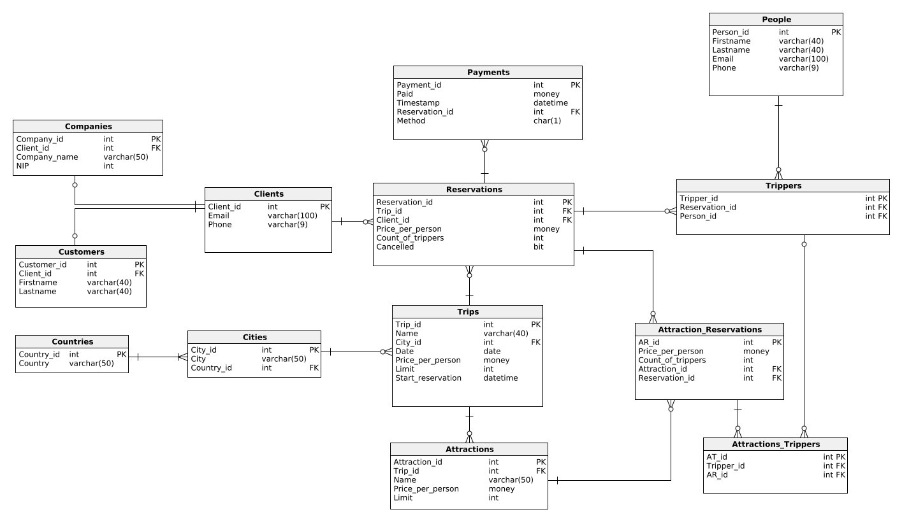

---
# Baza danych dla biura turystycznego


**Autorzy:** Czernecki Paweł, Dziarkowski Michał, Matuszyński Wojciech, Szkarłat Szymon

--- 

# 1. Wymagania i funkcje systemu
## 1.1. Role:
W bazie danych mogą istnieć podmioty, które mają więcej niż jedną rolę. Jeżeli podmiot jest zarówno uczestnikiem jak i klientem wycieczki, zyskuje uprawnienia związane z obiema rolami. W przypadku, gdy podmiot jest jednocześnie klientem biura i jego administratorem, przewidziane są dwa osobne konta (jedno na stronie biura, drugie w panelu administracyjnym). 

### 1.1.1. Właściciel biura
  - Posiada minimalne uprawnienia w systemie.
  - Jego uprawnienia nie przekraczają uprawnienia zwykłego użytkownika systemu

### 1.1.2. Admin 
  - Posiada konto w panelu administracyjnym.
  - Posiada dostęp do edycji i wyświetlania wszystkich danych
  - Może reagować na nietypowe przypadki

### 1.1.3. Menadżer wycieczek
  - Zarządza organizacją poszczególnych wycieczek.
  - Ma uprawnienia do dodawania, edytowania i usuwania informacji o wycieczkach, atrakcjach oraz rezerwacjach.
  - Monitoruje dostępność miejsc i ustala cenę wycieczek.
  - Koordynuje zespoły przewodników i personelu towarzyszącego.

### 1.1.4. Pracownik - obsługa klienta
  - Zapisuje klientów na wycieczki
  - W pełni odpowiada za obsługę klienta
  - Odpowiada za płatności przebiegające między klientami a systemem.
  - W przypadku rezygnacji z wycieczki/fakultetu bądź niespełnienia wymogów, zwraca pieniądze klientom na ich konto.
  - Kontaktuje się z firmami przewoźniczymi i hotelarskimi w celu uzgodnienia zakwaterowania uczestników, a także dat i miejsc zbiórek.
  - Tydzień przed rozpoczęciem wycieczki wysyła administratorom listę klientów, którzy dopełnili obowiązków.
  - Informuje administratorów na temat zmiany/dodania szczegółów wycieczki (np. zmiana daty rozpoczęcia, udostępnienie miejscu i czasu zbiórki na wycieczkę).

### 1.1.5. Klient
  - Może być podmiotem indywidualnym lub firmą.
  - Posiada konto na stronie.
  - Może rezerwować wycieczki/fakultety przez kontakt z obsługą klienta.
  - Może rezygnować z wycieczki przez kontakt z obsługą klienta.
  - Może podawać dane uczestników przez kontakt z obsługą klienta.
  - Ma dostęp do listy aktualnej oferty naszych wycieczek, atrakcji.
  - Może sprawdzić na stronie sumę cen wszystkich swoich rezerwacji


## 1.2. Działanie biura turystycznego
### 1.2.1. Wycieczki  
  - Główna część oferty biura podróży
  - Zakup atrakcji/fakultetu jest możliwy tylko w przypadku uprzednio zakupionej wycieczki. 
  - Każda wycieczka ma własny dla siebie limit miejsc oraz cenę za osobę.

### 1.2.2. Fakultety (Atrakcje dodatkowe)
  - Dodatkowa/opcjonalna część oferty biura.
  - Klient może urozmacić wycieczkę uczestników poprzez zakup usług dodatkowych, które odbędą się w czasie wycieczki. 
  - Aby uczestnik mógł wziąć udział w fakultecie, musi być uczestnikiem związanej wycieczki. 
  - Każdy fakultet ma własny dla siebie limit miejsc oraz dodatkową cenę za osobę.

### 1.2.3. Rezerwacje Ofert
  - Klienci rezerwują wycieczki i fakultety w imieniu jednego lub wielu uczestników. 
  - Przy rezerwacji wycieczki podają liczbę uczestników. 
  - W terminie do tygodnia przed rozpoczęciem wycieczki klienci są zobowiązani do podania listy uczestników (mowa tutaj o podaniu danych kontaktowych uczestników: imię, nazwisko, email oraz nr telefonu), oraz wpłacenia pełnej kwoty za wycieczkę. 
  - W przypadku niedopełnienia obowiązku, rezerwacja jest usuwana przez administratora, a wpłacone dotychczas pieniądze zwracane są przez obsługę klienta. 
  - Fakultet można zamówić w dowolnym momencie po zamówieniu wycieczki, do tygodnia przed datą rozpoczęcia wycieczki. Musi przypisać do niego uczestnika imiennie do tygodnia przed rozpoczęciem wycieczki.
  - W przypadku, kiedy klient zmniejszy liczbę uczestników biorących udział w wycieczce/fakultecie, przysługuje mu zwrot wpłaconych pieniędzy pod warunkiem, że poinformował o tym fakcie biuro na tydzień przed rozpoczęciem wycieczki.

# 2. Baza danych
## 2.1. Schemat bazy danych


## 2.2. Opis poszczególnych tabel
<!-- (Dla każdej tabeli kod + opis w formie tabelki + kod DDL) -->


### Clients
Tabela zawiera klientów, którzy złożyli zamówienia na dane wycieczki, dokonali rezerwacji dla określonej liczby osób. Mogą to być zarówno osoby prywatne, jak i firmy. 
Dodatkowo mamy sprawdzenie czy stan konta jest dodatni.

| Nazwa atrybutu | Typ          | Opis/Uwagi        |
| -------------- | ------------ | ----------------- |
| Client_id      | int          | Primary Key (PK)  |
| Email          | varchar(100) | Adres email       |
| Phone          | varchar(9)   | Nr telefonu       |


```sql
CREATE TABLE Clients (
    Client_id int  NOT NULL IDENTITY(1, 1),
    Email varchar(100)  NOT NULL,
    Phone varchar(9)  NOT NULL,
    CONSTRAINT Clients_pk PRIMARY KEY  (Client_id)
);
```

### Companies
Tabela zawiera firmy, które dokonały rezerwacji wycieczki w systemie oraz dane je identyfikujące, tj. nazwa firmy oraz nr NIP.

| Nazwa atrybutu | Typ          | Opis/Uwagi  |
| -------------- | ------------ | ----------- |
| Company_id     | int          | PK          |
| Client_id      | int          | FK          |
| Company_name   | varchar(50)  | Nazwa firmy |
| NIP            | int          | Nr NIP      |


```sql
CREATE TABLE Companies (
    Company_id int  NOT NULL IDENTITY(1, 1),
    Client_id int  NOT NULL,
    Company_name varchar(50)  NOT NULL,
    NIP int  NOT NULL,
    CONSTRAINT Companies_pk PRIMARY KEY  (Company_id)
);
```

Definiowanie relacji pomiędzy tabelą Companies a Clients.
```sql
ALTER TABLE Companies ADD CONSTRAINT Companies_Clients
    FOREIGN KEY (Client_id)
    REFERENCES Clients (Client_id);
```


### Customers
Tabela zawiera informacje o klienta (osobach prywatnych), którzy dokonali rezerwacji wycieczki w systemie.

| Nazwa atrybutu | Typ          | Opis/Uwagi |
| -------------- | ------------ | ---------- |
| Customer_id    | int          | PK         |
| Client_id      | int          | FK         |
| Firstname      | varchar(40)  | Imię       |
| Lastname       | varchar(40)  | Nazwisko   |

```sql
CREATE TABLE Customers (
    Customer_id int  NOT NULL IDENTITY(1, 1),
    Client_id int  NOT NULL,
    Firstname varchar(40)  NOT NULL,
    Lastname varchar(40)  NOT NULL,
    CONSTRAINT Customers_pk PRIMARY KEY  (Customer_id)
);
```

Definiowanie relacji pomiędzy tabelą Customers a Clients.
```sql
ALTER TABLE Customers ADD CONSTRAINT Customers_Clients
    FOREIGN KEY (Client_id)
    REFERENCES Clients (Client_id);
```


### Trips
Tabela zawiera wycieczki, które oferuje biuro turystyczne.
Dodatkowo mamy sprawdzenie czy limit oraz cena za osobę są wartościami dodatnimi.

| Nazwa atrybutu             | Typ          | Opis/Uwagi                 |
| -------------------------- | ------------ | -------------------------- |
| Trip_id                    | int          | PK                         |
| Name                       | varchar(40)  | Nazwa wycieczki            |
| City_id                    | int          | FK                         |
| Date                       | date         | Data odbycia się wycieczki |
| Price_per_person           | money        | Cena za osobę              |
| Limit                      | int          | Limit osób na wycieczce    |
| Start_reservation          | datetime     | Data rozpoczęcia rezerwacji|


```sql
CREATE TABLE Trips (
    Trip_id int  NOT NULL IDENTITY(1, 1),
    Name varchar(40)  NOT NULL,
    City_id int  NOT NULL,
    Date date  NOT NULL,
    Price_per_person money  NOT NULL,
    Limit int  NOT NULL,
    Start_reservation datetime  NOT NULL,
    CONSTRAINT check_limit CHECK (Limit > 0),
    CONSTRAINT check_price_per_person CHECK (Price_per_person > 0),
    CONSTRAINT Trips_pk PRIMARY KEY  (Trip_id)
);
```

Definiowanie relacji pomiędzy tabelą Trips a Cities.
```sql
ALTER TABLE Trips ADD CONSTRAINT Trips_Cities
    FOREIGN KEY (City_id)
    REFERENCES Cities (City_id);
```

### Cities
Tabela zawiera nazwy miast, w których odbywają się wycieczki.

| Nazwa atrybutu | Typ          | Opis/Uwagi |
| -------------- | ------------ | ---------- |
| City_id        | int          | PK         |
| City           | varchar(50)  | Miasto     |
| Country_id     | int          | FK         |


```sql
CREATE TABLE Cities (
    City_id int  NOT NULL IDENTITY(1, 1),
    City varchar(50)  NOT NULL,
    Country_id int  NOT NULL,
    CONSTRAINT Cities_pk PRIMARY KEY  (City_id)
);
```

Definiowanie relacji pomiędzy tabelą Cities a Countries
```sql
ALTER TABLE Cities ADD CONSTRAINT Cities_Countries
    FOREIGN KEY (Country_id)
    REFERENCES Countries (Country_id);
```


### Countries
Tabela słownikowa zawierająca dopuszczalne nazwy państw.

| Nazwa atrybutu | Typ          | Opis/Uwagi  |
| -------------- | ------------ | ----------- |
| Customer_id    | int          | PK          |
| Country        | varchar(50)  | Nazwa kraju |


```sql
CREATE TABLE Countries (
    Country_id int  NOT NULL IDENTITY(1, 1),
    Country varchar(50)  NOT NULL,
    CONSTRAINT Countries_pk PRIMARY KEY  (Country_id)
);
```


### Attractions
Atrakcje oferowane przez biuro podróży. Aby można było dokonać zakupu atrakcji dodatkowych należy najpierw zakupić wycieczkę.
Dodatkowo mamy sprawdzenie czy limit miejsc oraz cena za osobę są dodatnie.

| Nazwa atrybutu   | Typ          | Opis/Uwagi              |
| ---------------- | ------------ | ----------------------- |
| Attraction_id    | int          | PK                      |
| Trip_id          | int          | FK                      |
| Name             | varchar(50)  | Nazwa atrakcji          |
| Price_per_person | money        | Cena za osobę           |
| Limit            | int          | Limit osób na wycieczce |


```sql
CREATE TABLE Attractions (
    Attraction_id int  NOT NULL IDENTITY(1, 1),
    Trip_id int  NOT NULL,
    Name varchar(50)  NOT NULL,
    Price_per_person money  NOT NULL,
    Limit int  NOT NULL,
    CONSTRAINT Attractions_check_limit CHECK (Limit > 0),
    CONSTRAINT Attractions_check_price_per_person CHECK (Price_per_person > 0),
    CONSTRAINT Attractions_pk PRIMARY KEY  (Attraction_id)
);
```

Definiowanie relacji pomiędzy tabelą Attractions a Trips_Attractions
```sql
ALTER TABLE Attractions ADD CONSTRAINT Trips_Attractions
    FOREIGN KEY (Trip_id)
    REFERENCES Trips (Trip_id);
```

### Attraction_Reservations
W tej tabeli umieszczane są zarezerwowane atrakcje. Dodatkowo mamy sprawdzenie czy liczba zarezerwowanych miejsc jest dodatnia oraz czy cena za osobę również jest dodatnia.

| Nazwa atrybutu    | Typ          | Opis/Uwagi                    |
| ----------------- | ------------ | ----------------------------- |
| AR_id             | int          | Rezerwacja atrakcji (PK)      |
| Price_per_person  | money        | Cena za osobę                 |
| Count_of_trippers | int          | Liczba zarezerwowanych miejsc |
| Attraction_id     | in           | FK                            |
| Reservation_id    | int          | FK                            |

```sql
CREATE TABLE Attraction_Reservations (
    AR_id int  NOT NULL IDENTITY(1, 1),
    Price_per_person money  NOT NULL,
    Count_of_trippers int  NOT NULL,
    Attraction_id int  NOT NULL,
    Reservation_id int  NOT NULL,
    CONSTRAINT Attraction_Reservations_check_count_of_trippers CHECK (Count_of_trippers > 0),
    CONSTRAINT Attraction_Reservations_check_price_per_person CHECK (Price_per_person > 0),
    CONSTRAINT Attraction_Reservations_pk PRIMARY KEY  (AR_id)
);
```

Definiowanie relacji pomiędzy tabelą Attraction_Reservations a Attractions.
```sql
ALTER TABLE Attraction_Reservations ADD CONSTRAINT Attraction_Reservations_Attractions
    FOREIGN KEY (Attraction_id)
    REFERENCES Attractions (Attraction_id);
```

Definiowanie relacji pomiędzy tabelą Attraction_Reservations a Reservations.
```sql
ALTER TABLE Attraction_Reservations ADD CONSTRAINT Attraction_Reservations_Reservations
    FOREIGN KEY (Reservation_id)
    REFERENCES Reservations (Reservation_id);
```

### Attractions_Trippers
Tabela zawiera wylistowanych uczestników poszczególnych atrakcji.

| Nazwa atrybutu | Typ  | Opis/Uwagi                       |
| -------------- | ---- | -------------------------------- |
| AT_id          | int  | Atracja dla danej wycieczki (PK) |
| Tripper_id     | int  | FK                               |
| AR_id          | int  | FK                               |

```sql
CREATE TABLE Attractions_Trippers (
    AT_id int  NOT NULL IDENTITY(1, 1),
    Tripper_id int  NOT NULL,
    AR_id int  NOT NULL,
    CONSTRAINT Attractions_Trippers_pk PRIMARY KEY  (AT_id)
);
```

Definiowanie relacji pomiędzy tabelą Attractions_Trippers a Attraction_Reservations.
```sql
ALTER TABLE Attractions_Trippers ADD CONSTRAINT Attractions_Trippers_Attraction_Reservations
    FOREIGN KEY (AR_id)
    REFERENCES Attraction_Reservations (AR_id);
```

Definiowanie relacji pomiędzy tabelą Attractions_Trippers a Trippers.
```sql
ALTER TABLE Attractions_Trippers ADD CONSTRAINT Attractions_Trippers_Trippers
    FOREIGN KEY (Tripper_id)
    REFERENCES Trippers (Tripper_id);
```

### Reservations
W tabeli tej mamy umieszczone informacje o wszystkich dokonanych rezerwacjach.
Dodano również sprawdzenie czy cena za osobę oraz liczba zarezerwowanych miejsc są dodatnie.

| Nazwa atrybutu    | Typ          | Opis/Uwagi                                  |
| ----------------- | ------------ | ------------------------------------------- |
| Reservation_id    | int          | PK                                          |
| Trip_id           | int          | FK                                          |
| Client_id         | int          | FK                                          |
| Count_of_trippers | int          | Liczba zarezerwowanych miejsc               |
| Cancelled         | bit          | Informacja czy rezerwacja została anulowana |


```sql
CREATE TABLE Reservations (
    Reservation_id int  NOT NULL IDENTITY(1, 1),
    Trip_id int  NOT NULL,
    Client_id int  NOT NULL,
    Price_per_person money  NOT NULL,
    Count_of_trippers int  NOT NULL,
    Cancelled bit  NOT NULL,
    CONSTRAINT check_price_per_person CHECK (Price_per_person > 0),
    CONSTRAINT Reservations_pk PRIMARY KEY  (Reservation_id)
);
```

Definiowanie relacji pomiędzy tabelą Reservations a Clients.
```sql
ALTER TABLE Reservations ADD CONSTRAINT Reservations_Clients
    FOREIGN KEY (Client_id)
    REFERENCES Clients (Client_id);
```

Definiowanie relacji pomiędzy tabelą Reservations a Trips.
```sql
ALTER TABLE Reservations ADD CONSTRAINT Reservations_Trips
    FOREIGN KEY (Trip_id)
    REFERENCES Trips (Trip_id);
```


### Trippers
Tabela zawiera wylistowanych uczestników poszczególnych wycieczek, które znajdują się w ofercie biura turystycznego.

| Nazwa atrybutu | Typ  | Opis/Uwagi |
| -------------- | ---- | ---------- |
| Tripper_id     | int  | PK         |
| Reservation_id | int  | FK         |
| Person_id      | int  | FK         |


```sql
CREATE TABLE Trippers (
    Tripper_id int  NOT NULL IDENTITY(1, 1),
    Reservation_id int  NOT NULL,
    Person_id int  NOT NULL,
    CONSTRAINT Trippers_pk PRIMARY KEY  (Tripper_id)
);
```

Definiowanie relacji pomiędzy tabelą Trippers a People.
```sql
ALTER TABLE Trippers ADD CONSTRAINT Trippers_People
    FOREIGN KEY (Person_id)
    REFERENCES People (Person_id);
```

Definiowanie relacji pomiędzy tabelą Trippers a Reservations.
```sql
ALTER TABLE Trippers ADD CONSTRAINT Trippers_Reservations
    FOREIGN KEY (Reservation_id)
    REFERENCES Reservations (Reservation_id);
```


### People
Tabela zawiera dane uczestników poszczególnych wycieczek.

| Nazwa atrybutu | Typ          | Opis/Uwagi  |
| -------------- | ------------ | ----------- |
| Person_id      | int          | PK          |
| Firstname      | varchar(40)  | Imię        |
| Lastname       | varchar(40)  | Nazwisko    |
| Email          | varchar(100) | Adres email |
| Phone          | varchar(9)   | Nr telefonu |


```sql
CREATE TABLE People (
    Person_id int  NOT NULL IDENTITY(1, 1),
    Firstname varchar(40)  NOT NULL,
    Lastname varchar(40)  NOT NULL,
    Email varchar(100)  NOT NULL,
    Phone varchar(9)  NOT NULL,
    CONSTRAINT People_pk PRIMARY KEY  (Person_id)
);
```

### Payments
Tabela zawiera wszystkie operacje (wpłaty i zwrot na konto) jakich dokonano w biurze turystycznym. Dodano sprawdzenie czy kwota transakcji jest dodatnia.

| Nazwa atrybutu | Typ      | Opis/Uwagi                |
| -------------- | -------- | ------------------------- |
| Payment_id     | int      | PK                        |
| Paid           | money    | Kwota zapłacona/wypłacona |
| Timestamp      | datetime | Czas dokonania transakcji |
| Reservation_id | int      | FK                        |
| Method         | char(1)  | Metoda płatności          |

```sql
CREATE TABLE Payments (
    Payment_id int  NOT NULL IDENTITY(1, 1),
    Paid money  NOT NULL,
    Timestamp datetime  NOT NULL,
    Reservation_id int  NOT NULL,
    Method char(1)  NOT NULL,
    CONSTRAINT Payments_check_paid CHECK (Paid > 0),
    CONSTRAINT Payments_check_method CHECK (Method IN ('M', 'C', 'P', 'B')),
    CONSTRAINT Payments_pk PRIMARY KEY  (Payment_id)
);
```

Definiowanie relacji pomiędzy tabelą Payments a Reservations.
```sql
ALTER TABLE Payments ADD CONSTRAINT Payments_Reservations
    FOREIGN KEY (Reservation_id)
    REFERENCES Reservations (Reservation_id);
```


# 3.  Widoki, procedury/funkcje, triggery 
## Widoki
### Trip_Offers
Oferty wycieczek w biurze turystycznym. Informacja o poszczególnej ofercie zawiera:
* Trip_id
* Nazwę wycieczki
* Nazwę miast oraz państwa, w którym wycieczka się odbędzie
* Cenę za osobę
* Maksymalną liczbę osób, która może pojechać na wycieczkę
* Datę odbycia się wycieczki

```sql
create or alter view Trip_Offers as
select
    t.Trip_id,
    t.Name,
    ci.City,
    co.Country,
    t.Price_per_person,
    t.Limit,
    t.Date
from Trips t
join Cities ci on ci.City_id=t.City_id
join Countries co on co.Country_id=ci.Country_id;
```
|Trip_id|Name|City|Country|Price_per_person|Limit|Date|
|---|---|---|---|---|---|---|
|1|Discover Paris|Paris|France|500,00|20|2024-06-15|
|2|Explore Rome|Rome|Italy|600,00|15|2024-07-10|
|3|Adventures in Tokyo|Tokyo|Japan|700,00|25|2024-08-20|
|4|Safari in Guadalajara|Guadalajara|Mexico|650,00|18|2024-09-05|
|5|Cruise in Sydney|Sydney|Australia|900,00|30|2024-10-15|
|6|Hike in Machu Picchu|Lima|Peru|1080,00|22|2024-11-10|
|7|Holidays in USA|New York|United States|5100,00|17|2024-12-01|
|8|Relaxing in Athens|Athens|Greece|1200,00|28|2025-01-20|
|9|Snorkelling in Australia|Sydney|Australia|4500,00|10|2024-06-21|


<!-- ### Trips_value_for_clients
Widok, który dla każdego klienta pokazuje ile będą go kosztować zarezerwowane przez niego wycieczki i atrakcje. 
*left join* został użyty po to, aby uwzględnić również nieopłacone jeszcze rezerwacje - takie, dla których nie dokonano jeszcze wpłat (brak wpisów w tabeli Payments).

```sql
create or alter view Trips_value_for_clients as
select 
    c.Client_id,
    r.Reservation_id,
    COALESCE((r.Count_of_trippers * r.Price_per_person) +
    (at.Count_of_trippers * at.Price_per_person),0)
    Trips_and_attractions_value
from Reservations r
left join Clients c on c.Client_id=r.Client_id
left join Attraction_Reservations at on at.Reservation_id=r.Reservation_id
where Cancelled = 'false';
```
|Client_id|Reservation_id|Trips_and_attractions_value|
|---|---|--|
|15|1|540.0000|
|5|2|0.0000|
|18|4|0.0000|
|20|5|6960.0000| -->

### Trippers_lists
Lista imiennych uczestników na poszczególne wycieczki, które oferuje biuro turystyczne. Widok składa się z:
- Trip_id
- Nazwy wycieczki
- Imienia oraz nazwiska uczestnika wycieczki

```sql
create or alter view Trippers_lists as
select
    Trips.Trip_id TripId,
    Trips.Name TripName,
    p.Firstname,
    p.Lastname
from Reservations r
join Trippers on Trippers.Reservation_id=r.Reservation_id
join People p on p.Person_id=Trippers.Person_id
join Trips on Trips.Trip_id=r.Trip_id;
```
|TripId|TripName|Firstname|Lastname|
|--|--|--|--|
|1|Discover Paris|Mateusz|Kwiatkowska|
|3|Adventures in Tokyo|Jan|Nowak|
|3|Adventures in Tokyo|Marta|Kowalska|
|3|Adventures in Tokyo|Tadeusz|Wisniewski|
|3|Adventures in Tokyo|Katarzyna|Wójcik|
|6|Hike in Machu Picchu|Jan|Dabrowski|
|6|Hike in Machu Picchu|Aleksandra|Kozlowska|
|6|Hike in Machu Picchu|Pawel|Jankowski|
|6|Hike in Machu Picchu|Weronika|Wojciechowska|
|6|Hike in Machu Picchu|Mateusz|Kwiatkowska|


-----
<!--
Widok ten przedstawia stan konta dla klienta po uwzględnieniu dokonanych opłat oraz kosztów związanych z organizacją wycieczek i atrakcji dla określonej liczby osób.
Jeżeli klient wyszedł na 0, oznacza, że nie zalega z wpłatami.
Jeżeli jego kwota jest dodatnia oznacza to, że należy zwrócić mu kwotę, ponieważ wpłacił on za dużo. 
Jeżeli kwota jest ujemna klient nie wpłacił pełenj kwoty wycieczki.

```sql
create view Balance_Clients as
select
    c.Client_id,
    pa.paid - COALESCE((r.Count_of_trippers * r.Price_per_person) +
    (at.Count_of_trippers * at.Price_per_person),0) balance
from Reservations r
left join Clients c on c.Client_id=r.Client_id
left join AttractionReservations at on at.Reservation_id=r.Reservation_id
left join Payments pa on pa.Reservation_id=r.Reservation_id
where r.Cancelled = 'false';
```
-->
### Available_Trips
Widok wypisuje informacje o wycieczkach dostępnych w ofercie biura podróży. Zawiera informacje o:
* Trip_id
* Nazwie wycieczki
* Mieście oraz państwie, w którym wycieczka będzie miała miejsce
* Dacie odbycia się wycieczki
* Rozpoczęciu możliwości rezerwacji wycieczki (Timestamp)
* Cenie za osobę
* Maksymalnej, dopuszczalnej liczbie osób na wycieczkę (Limit)
* Liczbie wolnych miejsc na wycieczkę

```sql
create or alter view Available_Trips as
select
    t.Trip_id,
    t.Name as TripName,
    ci.City as CityName,
    co.Country as CountryName,
    t.Date as TripDate,
    t.Start_reservation,
    t.Price_per_person,
    t.Limit,
    t.Limit - ISNULL(SUM(r.Count_of_trippers), 0) as AvailableSpots
from Trips t
left join Cities ci on ci.City_id = t.City_id
left join Countries co on co.Country_id = ci.Country_id
left join Reservations r on r.Trip_id = t.Trip_id and r.Cancelled = 0
where t.Date > getdate() and t.Start_reservation < getdate()
group by t.Trip_id, t.Name, ci.City, co.Country, t.Date, t.Start_reservation, t.Price_per_person, t.Limit
having t.Limit - ISNULL(SUM(r.Count_of_trippers), 0) != 0;
```

|Trip_id|TripName|CityName|CountryName|TripDate|Start_reservation|Price_per_person|Limit|AvailableSpots|
|---|---|---|---|---|---|---|---|--|
|2|Explore Rome|Rome|Italy|2024-07-10|2024-06-10 09:00:00.000|600.0000|15|15|
|4|Safari in Guadalajara|Guadalajara|Mexico|2024-09-05|2024-05-21 10:00:00.000|650.0000|18|14|
|6|Hike in Machu Picchu|Lima|Peru|2024-11-10|2024-05-22 11:00:00.000|1080.0000|22|16|
|7|Holidays in USA|New York|United States|2024-12-01|2024-01-01 14:00:00.000|5100.0000|17|17|


### Payment_Details_History
Widok w celach archiwalnych, pokazujący wszystkie dotychczasowe płatności.
Widok składa się z informacji:
* Payment_id
* kwocie wpłaty
* kiedy dokonano wpłaty (Timestamp)
* jaką metodą płatności dokonano wpłaty
* na jaką rezerwację dokonano wpłaty
* jaki klient dokonał wpłaty (Client_id)

```sql
create or alter view Payment_Details_History as
select 
    pa.payment_id,
    pa.paid,
    pa.timestamp,
    pa.method,
    r.reservation_id,
    c.client_id,
    case 
        when cust.customer_id is not null then cust.firstname + ' ' + cust.lastname
        when comp.company_id is not null then comp.company_name
    end as clientname,
    t.trip_id,
    t.name as tripname
from payments pa
join reservations r on r.reservation_id = pa.reservation_id
join clients c on c.client_id = r.client_id
left join customers cust on cust.client_id = c.client_id
left join companies comp on comp.client_id = c.client_id
left join trips t on t.trip_id = r.trip_id;
```
|payment_id|paid|timestamp|method|reservation_id|client_id|clientname|trip_id|tripname|
|---|---|---|---|---|---|---|---|---|
|1|540,00|2024-05-19 18:31:34.000|M|1|15|Andrzej Kowalczyk|1|Discover Paris|
|2|3120,00|2024-05-19 18:31:34.000|M|2|5|Future Builders|3|Adventures in Tokyo|
|3|2600,00|2024-05-19 18:31:34.000|C|4|18|Joanna Zielinska|4|Safari in Guadalajara|
|4|7200,00|2024-05-19 18:31:34.000|P|5|20|Magdalena Wozniak|6|Hike in Machu Picchu|
----

### Client_List
Lista klientów wraz z listą wykonanych przez nich rezerwacji.
Widok składa się z:
* Client_id
* Typu klienta - informacja czy klient jest osobą fizyczną czy firmą
* Nazway firmy lub imienia i nazwiska osoby fizczynej
* Numeru telefonu
* Emailu
* Numeru NIP dla firmy
* Liczby aktywnych rezerwacji
* Liczby anulowanych rezerwacji

```sql
CREATE OR ALTER VIEW Client_List AS
SELECT
    C.Client_id,
    'COMPANY' AS Client_Type,
    Cm.Company_name AS Name,
    C.Phone,
    C.Email,
    Cm.NIP,
    COUNT(R2.Reservation_id) AS Count_of_active_reservations,
    COALESCE(
            (SELECT COUNT(*) FROM Reservations R WHERE R.Client_id = C.Client_id AND R.Cancelled = 1),
            0) AS Count_of_cancelled_reservations
FROM Companies Cm
JOIN Clients C ON Cm.Client_id = C.Client_id
LEFT JOIN Reservations R2 ON C.Client_id = R2.Client_id AND R2.Cancelled = 0
GROUP BY C.Client_id, Cm.Company_name, C.Phone, C.Email, Cm.NIP
UNION ALL
SELECT
    C.Client_id,
    'PERSON' AS Client_Type,
    P.Firstname + ' ' + P.Lastname AS Name,
    C.Phone,
    C.Email,
    NULL AS NIP,
    COUNT(R3.Reservation_id) AS Count_of_active_reservations,
    COALESCE(
            (SELECT COUNT(*) FROM Reservations R WHERE R.Client_id = C.Client_id AND R.Cancelled = 1),
            0) AS Count_of_cancelled_reservations
FROM Customers P
JOIN Clients C ON P.Client_id = C.Client_id
LEFT JOIN Reservations R3 ON C.Client_id = R3.Client_id AND R3.Cancelled = 0
GROUP BY C.Client_id, P.Firstname, P.Lastname, C.Phone, C.Email;
```

|Client_id|Client_Type   |Name                |Phone    |Email                              |NIP       |Count_of_active_reservations|Count_of_cancelled_reservations|
|---------|--------------|---------------------|---------|-----------------------------------|----------|-----------------|-|
|1        |COMPANY       |Tech Innovators      |123456789|techinnovators@example.com         |1234567890|0                |0|
|2        |COMPANY       |Green Solutions      |987654321|greensolutions@greentech.net       |1234567891|0                |0|
|3        |COMPANY       |Health First         |456789123|info@healthfirst.net               |1234567892|0                |0|
|4        |COMPANY       |Creative Minds       |789123456|support@creativeminds.tech         |1234567893|0                |0|
|5        |COMPANY       |Future Builders      |321654987|builders@thefuturebuildersgroup.com|1234567894|1                |0|
|6        |COMPANY       |Smart Home Inc.      |654987321|contact@futurebuilders.net         |1234567895|0                |0|
|7        |COMPANY       |Digital Dynamics     |147258369|contact@digitaldynamics.org        |1234567896|0                |0|
|8        |COMPANY       |Eco Energy           |258369147|support@ecoenergy.org              |1234567897|1                |0|
|9        |COMPANY       |Finance Hub          |369147258|support@financehub.org             |1234567898|0                |0|
|10       |COMPANY       |Fashion Forward      |963852741|sales@fashionforward.tech          |1234567899|0                |0|
|11       |PERSON        |Jan Kowalski         |741852963|kowalski@example.com               |          |0                |0|
|12       |PERSON        |Anna Nowak           |852963147|nowak@example.com                  |          |0                |0|
|13       |PERSON        |Piotr Wisniewski     |369852147|wisniewski@example.com             |          |0                |1|
|14       |PERSON        |Katarzyna Wójcik     |258741369|wojcik@example.com                 |          |0                |0|
|15       |PERSON        |Andrzej Kowalczyk    |123789456|kowalczyk@example.com              |          |1                |0|
|16       |PERSON        |Malgorzata Kaminska  |987654123|kaminska@example.com               |          |0                |0|
|17       |PERSON        |Stanislaw Lewandowski|654123789|lewandowski@example.com            |          |0                |0|
|18       |PERSON        |Joanna Zielinska     |456321987|zielinska@example.com              |          |1                |0|
|19       |PERSON        |Tomasz Szymanski     |789456123|szymanski@example.com              |          |0                |0|
|20       |PERSON        |Magdalena Wozniak    |321987654|wozniak@example.com                |          |1                |0|

### City_List
Widok wyświetlający wszystkie miasta z naszego systemu wraz z krajami.

```sql
create or alter view City_List as
select Cities.City_id , Cities.City, C.Country
from Cities
join dbo.Countries C on C.Country_id = Cities.Country_id
```

Użycie:
```sql
select * from City_List order by Country
```

|City_id|City|Country|
|-|-|-|
|1|Rome|Italy|
|2|Venice|Italy|
|3|Florence|Italy|
|4|Paris|France|
|5|Nice|France|
|6|Lyon|France|
|7|Barcelona|Spain|
|8|Madrid|Spain|
|9|Seville|Spain|
|10|New York|United States|
|11|Los Angeles|United States|
|12|Chicago|United States|
|13|Tokyo|Japan|
|14|Kyoto|Japan|
|15|Osaka|Japan|
|16|Sydney|Australia|
|17|Melbourne|Australia|
|18|Brisbane|Australia|
|19|Athens|Greece|
|20|Santorini|Greece|
|21|Mykonos|Greece|
|22|Cancun|Mexico|
|23|Mexico City|Mexico|
|24|Guadalajara|Mexico|
|25|Bangkok|Thailand|
|26|Chiang Mai|Thailand|
|27|Phuket|Thailand|
|28|Cuzco|Peru|
|29|Lima|Peru|
|30|Jaen|Peru|

### Attractions_Lists
Widok wyświetlający uczestników na każdą wycieczkę

```sql
create or alter view Attractions_Lists as
Select A.Attraction_id, P.Firstname, P.Lastname, A.Name
From People P
inner join Trippers T on P.Person_id=T.Person_id
inner join Attractions_Trippers AT on AT.Tripper_id=T.Tripper_id
inner join Attraction_Reservations AR on AR.AR_id = AT.AR_id
inner join Attractions A on A.Attraction_id = AR.Attraction_id
```

Użycie:
|Attraction_id|Firstname|Lastname|Name|
|---|---|---|---|
|2|Mateusz|Kwiatkowska|Louvre Museum Visit|
|7|Jan|Nowak|Tokyo Disneyland Tickets|
|7|Marta|Kowalska|Tokyo Disneyland Tickets|
|7|Tadeusz|Wisniewski|Tokyo Disneyland Tickets|
|7|Katarzyna|W&#243;jcik|Tokyo Disneyland Tickets|
|17|Jan|Dabrowski|Inca Trail Trek|
|17|Aleksandra|Kozlowska|Inca Trail Trek|
|17|Pawel|Jankowski|Inca Trail Trek|
|17|Weronika|Wojciechowska|Inca Trail Trek|


## Procedury
### update_trip_price
Procedura pozwalająca dla wybranej wycieczki (trip_id) zmienić jej cenę za osobę (new_price).

```sql
create procedure update_trip_price
    @trip_id int,
    @new_price money
as
begin
    update Trips
    set Price_per_person = @new_price
    where Trip_id = @trip_id;
end;
```

Testy:
1. Dla wycieczki o Trip_id=1 ustawiamy nową cenę (500,00).
    ```sql
    select Trip_id, Price_per_person from trips
    where Trip_id = 1;
    ```

    |Trip_id|Price_per_person|
    |---|---|
    |1|500,00|

1. Dla wycieczki o Trip_id=1 ustawiamy nową cenę (600,00).
    ```sql
    exec update_trip_price 1, 600;
    select Trip_id, Price_per_person from trips
    where Trip_id = 1;
    ```
    |Trip_id|Price_per_person|
    |---|---|
    |1|600,00|


### update_trip_limit
Procedura pozwalająca dla wybranej wycieczki (trip_id) zmienić limit jej uczestników (new_limit). Sprawdzanie, czy możemy to wykonać realizowane jest przez trigger o nazwie **[CheckTripLimitUpdate](#checktriplimitupdate)**.
```sql
create procedure update_trip_limit
    @trip_id int,
    @new_limit int 
as
begin
    update Trips
    set Limit = @new_limit
    where Trip_id = @trip_id;
end;
```
Testy działania:
1. Zmiana limitu dla wycieczki Trip_id=1 na 20 miejsc. 
    ```sql
    select trip_id, Limit from trips
    where trip_id = 1;
    ```

    |trip_id|Limit|
    |---|---|
    |1|20|

2. Zmiana limitu dla wycieczki Trip_id=1 na 15 miejsc. 
    ```sql
    exec update_trip_limit 1, 15;
    select trip_id, Limit from trips
    where trip_id = 1;
    ```

    |trip_id|Limit|
    |---|---|
    |1|15|


### update_attraction_price
Procedura pozwalająca dla wybranej wycieczki (attraction_id) zmienić cenę za osobę (new_price).
```sql
create procedure update_attraction_price
    @attraction_id int,
    @new_price money
as
begin
    update Attractions
    set Price_per_person = @new_price
    where Attraction_id = @attraction_id;
end;
```
Testy działania:
1. Zmiana ceny za atrakcję (Attraction_id=1) na 50,00.
    ```sql
    select Attraction_id, Price_per_person from Attractions
    where Attraction_id = 1;
    ```

    |Attraction_id|Price_per_person|
    |---|---|
    |1|50,00|

2. Zmiana ceny za atrakcję (Attraction_id=1) na 600,00.
    ```sql
    exec update_attraction_price 1, 600;
    select Attraction_id, Price_per_person from Attractions
    where Attraction_id = 1;
    ```

    |Attraction_id|Price_per_person|
    |---|---|
    |1|600,00|


### update_attraction_limit
Procedura pozwalająca dla wybranej wycieczki (attraction_id) zmienić limit jej uczestników(new_limit). Trigger **[CheckAttractionLimitUpdate](#checkattractionlimitupdate)** sprawdza czy możemy ustawić podany limit dla danej atrakcji. 
```sql
create procedure update_attraction_limit
    @attraction_id int,
    @new_limit int
as
begin
    update Attractions
    set Limit = @new_limit
    where Attraction_id = @attraction_id;
end;
```

Testy działania:
1. Zmiana limitu atrakcji (Attraction_id=1) na 15 osoób.
    ```sql
    select Attraction_id, Limit from Attractions
    where Attraction_id = 1;
    ```

    |Attractions_id|Limit|
    |---|---|
    |1|15|

2. Zmiana limitu atrakcji (Attraction_id=1) na 5 osoób.
    ```sql
    exec update_attraction_limit 1, 55;
    select Attraction_id, Limit from Attractions
    where Attraction_id = 1;
    ```

    |Attraction_id|Limit|
    |---|---|
    |1|5|

<!-- ### update_trip_date
Procedura pozwalająca na zaaktualizowanie daty odbycia się wycieczki (pole Date).

```sql
create or alter procedure update_trip_date
(
    @Trip_id int,
    @Date date
)
as
begin
    update Trips
    set Date = @Date
    where Trip_id = @Trip_id;
end;
```

Test działania
```sql
exec update_trip_date
    @Trip_id = 1,
    @Date = '2024-06-17'
```

Wygląd rekordu Trip_id = 1, po wprowadzonych zmianach.
|Trip_id|Name|City_id|Date|Price_per_person|Limit|Start_reservation|
|--|--|--|--|--|--|--|
|1|Discover Paris|4|2024-06-17|600.0000|20|2024-05-15 10:00:00.000|


### update_trip_start_reservation
Procedura umożliwia zaaktualizowanie daty rozpoczęcia rezerwacji.

```sql
create or alter procedure update_trip_start_reservation
(
    @Trip_id int,
    @Start_reservation datetime
)
as
begin
    update Trips
    set Start_reservation = @Start_reservation
    where Trip_id = @Trip_id;
end;
```

Test działania
```sql
exec update_trip_start_reservation
    @Trip_id = 1,
    @Start_reservation = '2024-05-15 10:00:00.000'
```

Wygląd rekordu Trip_id = 1, po wprowadzonych zmianach.
|Trip_id|Name|City_id|Date|Price_per_person|Limit|Start_reservation|
|--|--|--|--|--|--|--|
|1|Discover Paris|4|2024-06-17|600.0000|20|2024-05-15 08:00:00.000| -->


### add_new_client
Procedura umożliwiająca dodanie nowego klienta do bazy danych. 

```sql
create or alter procedure add_new_client
    @Email varchar(100),
    @Phone varchar(9),
    @Client_type char(1), -- 'C' dla osoby fizycznej, 'P' dla firmy
    @Firstname varchar(40) = null,
    @Lastname varchar(40) = null,
    @Company_name varchar(50) = null,
    @NIP int = null
as
begin
    begin transaction;

    begin try
        set nocount on;

        -- Sprawdzanie warunków przed wykonaniem operacji
        if @Client_type = 'C' and (@Firstname is null or @Lastname is null)
        begin
            raiserror('Firstname and Lastname are required for Customers.', 16, 1);
            rollback transaction;
            return;
        end

        if @Client_type = 'P' and (@Company_name is null or @NIP is null)
        begin
            raiserror('CompanyName and NIP are required for Companies.', 16, 1);
            rollback transaction;
            return;
        end

        if @Client_type not in ('C', 'P')
        begin
            raiserror('Invalid Client_type. Use ''C'' for Customers or ''P'' for Companies.', 16, 1);
            rollback transaction;
            return;
        end

        declare @Client_id int;

        -- Dodawanie nowego klienta do tabeli Clients
        insert into Clients (Email, Phone)
        values (@Email, @Phone);

        -- Pobieranie ID nowo dodanego klienta
        set @Client_id = SCOPE_IDENTITY();

        -- Dodawanie klienta do tabeli Customers lub Companies na podstawie typu klienta
        if @Client_type = 'C'
        begin
            insert into Customers (Client_id, Firstname, Lastname)
            values (@Client_id, @Firstname, @Lastname);
        end
        else if @Client_type = 'P'
        begin
            insert into Companies (Client_id, Company_name, NIP)
            values (@Client_id, @Company_name, @NIP);
        end

        -- Jeśli wszystko się powiodło, zatwierdź transakcję
        commit transaction;
    end try
    begin catch
        -- Jeśli wystąpił błąd, wycofaj transakcję
        if @@TRANCOUNT > 0
            rollback transaction;

        -- Rzuć błąd ponownie, aby informować o problemie
        throw;
    end catch
end;
```

Testy sprawdzające działanie procedury.
1. Dodanie nowego klienta fizycznego. 
W tym celu należy podać:
    * Email
    * Phone - numer telefonu
    * Client_type - informacja o tym czy wprowadzany klient jest osobą fizyczną (C) lub firmą (P)
    * Firstname - imię klienta
    * Lastname - nazwisko klienta

    ```sql
    exec add_new_client
        @Email = 'john.doe@example.com',
        @Phone = '123456789',
        @Client_type = 'C',
        @Firstname = 'John',
        @Lastname = 'Doe';
    ```

    Wynik wykonania powyższej procedury:
    * tabela Clients
        ```sql
        select * from Clients
        where Email = 'john.doe@example.com'
        ```

        |Client_id|Email|Phone|
        |---|---|--|
        |21|john.doe@example.com|123456789|


    * tabela Clients + Customers
        ```sql
        select cu.Client_id, FirstName, Lastname, Email, Phone from Clients cl
        join Customers cu on cu.Client_id=cl.Client_id
        where Email = 'john.doe@example.com';
        ```

        |Client_id|Firstname|Lastname|Email|Phone|
        |---|---|--|--|--|
        |21|John|Doe|john.doe@example.com|123456789|


2. Dodanie nowej firmy.
W tym celu należy podać:
    * Email
    * Phone - numer telefonu
    * Client_type - informacja o tym czy wprowadzany klient jest osobą fizyczną (C) lub firmą (P)
    * Companyname - nazwa firmy
    * NIP - nr NIP

    ```sql
    exec add_new_client
        @Email = 'contact@microsoft.com',
        @Phone = '987654321',
        @Client_type = 'P',
        @Company_name = 'Microsoft',
        @NIP = 1234567890;
    ```

    Wynik wykonania powyższej procedury:
    * tabela Clients
        ```sql
        select * from Clients
        where Email = 'contact@microsoft.com'
        ```

        |Client_id|Email|Phone|
        |---|---|--|
        |22|contact@microsoft.com|987654321|

    * tabela Clients + Customers
        ```sql
        select co.Client_id, Company_name, NIP, Email, Phone from Clients cl
        join Companies co on co.Client_id=cl.Client_id
        where Email = 'contact@microsoft.com';
        ```

        |Client_id|Company_name|NIP|Email|Phone|
        |---|---|--|--|--|
        |22|Microsoft|123456789|contact@microsoft.com|987654321|


### add_new_trip
Procedura ta umożliwia dodawanie nowej wycieczki. Jeżeli wycieczka dodawana jest do nowego kraju lub miasta, sprawdzamy czy podany kraj lub miasto znajdują się w tabeli odpowiednio Countries czy Cities.

```sql
create or alter procedure add_new_trip
(
    @Name varchar(40),
    @City varchar(50),
    @Country varchar(50),
    @Date date,
    @Price_per_person money,
    @Limit int,
    @Start_reservation datetime
)
as
begin
    declare @City_id int;
    declare @Country_id int;

    -- Sprawdzenie, czy daty są poprawne
    if @Date < getdate()
    begin
        raiserror('The trip start date cannot be in the past.', 16, 1);
        return;
    end

    if @Start_reservation < cast(getdate() as date)
    begin
        raiserror('The reservation start date cannot be in the past.', 16, 1);
        return;
    end

    if @Date < DATEADD(Day, 7, @Start_reservation)
    begin
        raiserror('The trip start date must be at least 7 days later than the reservation start date.', 16, 1);
        return;
    end

    -- Sprawdzenie czy kraj i miasto już istnieją
    if EXISTS (select * from Countries where Country = @Country)
           and EXISTS (select * from Cities where City = @City)
    begin
        select @Country_id = Country_id
        from Countries
        where Country = @Country;

        select @City_id = City_id
        from Cities
        where City = @City;
    end
    else
    begin
        raiserror('The specified country or city does not exist.', 16, 1);
        return;
    end

    -- Dodanie nowej wycieczki
    insert into Trips (Name, City_id, Date, Price_per_person, Limit, Start_reservation)
    values (@Name, @City_id, @Date, @Price_per_person, @Limit, @Start_reservation);
end;
```

Test działania:
Dodanie nowej wycieczki.
```sql
exec add_new_trip
    @Name = 'Sightseeing in paris',
    @City = 'Paris',
    @Country = 'France',
    @Date = '2024-07-22',
    @Price_per_person = '700.0000',
    @Limit = 15,
    @Start_reservation = '2024-06-22 2:00:00.000'
```

Po dodaniu nowej wycieczki, widzimy zmiany w tabeli Trips.
|Trip_id|Name|City_id|Date|Price_per_person|Limit|Start_reservation|
|--|--|--|--|--|--|--|
|9|Sightseeing in paris|4|2024-07-22|700.0000|15|2024-06-22 2:00:00.000|

<!-- 2. Dodanie wycieczki do nowego miasta (Neapol), ale istniejącego już w bazie danych państwa (Włochy).
    ```sql
    exec add_new_trip
    @Name = 'Travel to Naples',
    @City = 'Naples',
    @Country = 'Italy',
    @Date = '2024-08-20',
    @Price_per_person = '450.0000',
    @Limit = 7,
    @Start_reservation = '2024-06-11 12:00:00.000'
    ```

    Po dodaniu nowej wycieczki, widzimy zmiany w tabeli Trips.
    |Trip_id|Name|City_id|Date|Price_per_person|Limit|Start_reservation|
    |--|--|--|--|--|--|--|
    |10|Travel to Naples|31|2024-08-20|450.0000|7|2024-06-11 12:00:00.000|

3. Dodanie wycieczki do nowego miasta (Kraków) oraz nowego państwa (Polska).
    ```sql
    exec add_new_trip
    @Name = 'Walk around Krakow',
    @City = 'Krakow',
    @Country = 'Poland',
    @Date = '2024-10-15',
    @Price_per_person = '200.0000',
    @Limit = 20,
    @Start_reservation = '2024-08-13 05:00:00.000'
    ```

    Po dodaniu nowej wycieczki, widzimy zmiany w tabeli Trips.
    |Trip_id|Name|City_id|Date|Price_per_person|Limit|Start_reservation|
    |--|--|--|--|--|--|--|
    |11|Walk around Krakow|32|2024-10-15|200.0000|20|2024-08-13 05:00:00.000| -->


### add_new_attraction
Procedura jest odpowiedzialna za dodanie nowej atrakcji do istniejącej wycieczki. Dodatkowo mamy trigger **[CheckAttractionLimit](#checkattractionlimit)**, który sprawdza czy dodawana atrakcja ma limit mniejszy lub równy liczbie miejsc na daną wycieczkę.

```sql
create or alter procedure add_new_attraction
(
    @Trip_id int,
    @Name varchar(50),
    @Price_per_person money,
    @Limit int
)
as
begin
    insert into Attractions (Trip_id, Name, Price_per_person, Limit)
    values (@Trip_id, @Name, @Price_per_person, @Limit);
end;
```

Test działania
```sql
exec add_new_attraction
    @Trip_id = 2,
    @Name = 'Forum Romanum Visit',
    @Price_per_person = 60.0000,
    @Limit = 5
```

Po dodaniu nowej atrakcji dla wycieczki (Trip_id = 2), widzimy zmiany w tabeli Attractions.
|Attraction_id|Trip_id|Name|Price_per_person|Limit|
|--|--|--|--|--|
|25|2|Forum Romanum Visit|60.0000|5|

<!--
### update_client
```sql
create or alter procedure update_client
(
    @Client_id int,
    @New_value varchar(100),
    @Update_type char(1) -- 'E' dla Email, 'P' dla Phone
)
as
begin
    if @Update_type = 'E'
    begin
        update Clients
        set Email = @New_value
        where Client_id = @Client_id;
    end
    else if @Update_type = 'P'
    begin
        update Clients
        set Phone = @New_value
        where Client_id = @Client_id;
    end
    else
    begin
        raiserror('Invalid Update_type. Use ''E'' for Email or ''P'' for Phone.', 16, 1);
    end
end;
```

Testy działania:
* zmiana maila klienta
    ```sql
    exec update_client
        @Client_id = 11,
        @New_value = 'kowalski@onet.pl',
        @Update_type = 'E'
    ```

    |Client_id|Email|Phone|
    |--|--|--|
    |11|kowalski@onet.pl|741852963|

* zmiana nr telefonu firmy
    ```sql
    exec update_client
    @Client_id = 1,
    @New_value = '794551123',
    @Update_type = 'P'
    ```

    |Client_id|Email|Phone|
    |--|--|--|
    |1|techinnovators@example.com|794551123|
-->

### add_new_reservation
Procedura dodaje nową rezerwację dla podanego klienta. Dodatkowo triggery sprawdzają czy możemy wykonać tą akcję np. czy są wolne miejsca. Są to odpowiednio triggery:
* [CheckReservationLimit](#checkreservationlimit) - sprawdza czy jest jeszcze miejsce na podaną liczbę osób. 
* [CheckDateBeforeTrip](#checkdatebeforetrip) - sprawdza czy data dokonywania operacji dodawania nowej rezerwacji jest większa niż 7 dni od startu wycieczki. 
* [CheckReservationStart](#checkreservationstart) - sprawdza czy rezerwacja na daną wycieczkę ruszyła.

```sql
create or alter procedure add_new_reservation
(
    @Trip_id int,
    @Client_id int,
    @Count_of_trippers int,
    @Cancelled bit = 0
)
as
begin
    -- Uniemożliw dodanie rezerwacji z Cancelled = 1
    if @Cancelled = 1
    begin
        raiserror('Cannot add a reservation with Cancelled set to 1.', 16, 1);
        return;
    end

    declare @Price_per_person money;
    select @Price_per_person = Price_per_person from Trips where Trip_id = @Trip_id;

    insert into Reservations (Trip_id, Client_id, Price_per_person, Count_of_trippers, Cancelled)
    values (@Trip_id, @Client_id, @Price_per_person, @Count_of_trippers, @Cancelled);
end;
```

Test działania:
```sql
exec add_new_reservation
    @Trip_id = 8,
    @Client_id = 1,
    @Count_of_trippers = 1
```

W tabeli Reservations możemy dostrzec nową rezerwację dla klienta o Client_id = 1.
|Rervation_id|Trip_id|Client_id|Price_per_person|Count_of_trippers|Cancelled|
|--|--|--|--|--|--|
|12|8|1|1200.0000|1|false|


### cancel_reservation
Procedura umożliwia anulowanie danej rezerwacji
```sql
create or alter procedure cancel_reservation
(
    @Reservation_id int
)
as
begin
    -- Oznacz rezerwację jako anulowaną
    update Reservations
    set Cancelled = 1
    where Reservation_id = @Reservation_id;
end;
```

Test działania
```sql
exec cancel_reservation
    @Reservation_id = 1
```

Rezerwacja (Reservation_id = 1) dla wycieczki (Trip_id = 1) została anulowana.
|Reservation_id|Trip_id|Client_id|Price_per_person|Count_of_trippers|Cancelled|
|--|--|--|--|--|--|
|1|1|15|500.0000|1|true|

### return_reservation
Procedura umożliwiająca cofniecię anulowania rezerwacji. Dodatkowo jest trigger o nazwie **[CheckReservationLimit](#checkreservationlimit)**, który kontroluje i sprawdza czy wycieczka może zostać przywrócona, czy pozwala na to aktualna liczba zajętych miejsc.
```sql
create or alter procedure return_reservation
(
    @Reservation_id int
)
as
begin
    -- Cofnij anulowanie rezerwacji
    update Reservations
    set Cancelled = 0
    where Reservation_id = @Reservation_id;
end;
```

Testy działania
```sql
exec return_reservation
    @Reservation_id = 3
```

W wyniku tego działania po wykonaniu poniższego polecenia
```sql
select * from Reservations
where Reservation_id = 3
```
Otrzymujemy wynik
|Reservation_id|Trip_id|Client_id|Price_per_person|Count_of_trippers|Cancelled|
|--|--|--|--|--|--|
|3|3|13|700.0000|2|false|


### add_new_tripper
Procedura odpowiada za dodawanie nowego uczestnika wycieczki. Dodatkow mamy trigger figurujący pod nazwą **[CheckTripperCount](#checktrippercount)**. 
Sama procedura sprawdza, czy osoba już istnieje w tabeli **People**. Jeśli osoba nie istnieje, dodaje ją do tabeli **People**. Następnie dodaje nowego członka wycieczki do tabeli **Trippers**.
```sql
create or alter procedure add_new_tripper
    @Reservation_id int,
    @Firstname varchar(40),
    @Lastname varchar(40),
    @Email varchar(100),
    @Phone varchar(9)
as
begin
    begin transaction;

    begin try
        set nocount on;

        declare @Person_id int;
        declare @Cancelled bit;
        declare @Trip_id int;
        declare @Client_id int;

        -- Sprawdź, czy rezerwacja jest anulowana
        select @Cancelled = Cancelled, @Trip_id = Trip_id
        from Reservations
        where Reservation_id = @Reservation_id;

        if @Cancelled = 1
        begin
            raiserror('Cannot add a tripper to a cancelled reservation.', 16, 1);
            rollback transaction;
            return;
        end

        -- Sprawdź, czy osoba już istnieje w tabeli People
        select @Person_id = Person_id
        from People
        where Firstname = @Firstname
          and Lastname = @Lastname
          and Email = @Email
          and Phone = @Phone;

        -- Jeśli osoba nie istnieje, dodaj ją do tabeli People
        if @Person_id is null
        begin
            insert into People (Firstname, Lastname, Email, Phone)
            values (@Firstname, @Lastname, @Email, @Phone);

            set @Person_id = SCOPE_IDENTITY();
        end

        -- Pobranie Client_id, który dokonał rezerwacji
        select @Client_id = Client_id
        from Reservations
        where Reservation_id = @Reservation_id

        -- Sprawdź, czy osoba już jest przypisana do jakiejkolwiek rezerwacji w ramach tej samej wycieczki (Trip_id)
        if exists (
            select 1
            from Trippers t
            join Reservations r on t.Reservation_id = r.Reservation_id
            where r.Trip_id = @Trip_id and r.Client_id = @Client_id
              and t.Person_id = @Person_id
        )
        begin
            raiserror('This person is already a tripper for a reservation within the same trip.', 16, 1);
            rollback transaction;
            return;
        end

        -- Dodaj nowego członka wycieczki do tabeli Trippers
        insert into Trippers (Reservation_id, Person_id)
        values (@Reservation_id, @Person_id);

        commit transaction;
    end try
    begin catch
        if @@TRANCOUNT > 0
            rollback transaction;

        throw;
    end catch
end;
```

Test działania:
1. Dodanie istniejącej osoby. Ten uczestnik wycieczki jest już zapisany w tabeli People. 
    ```sql
    exec add_new_tripper
        @Reservation_id = 4,
        @Firstname = 'Adam',
        @Lastname = 'Kowalski',
        @Email = 'adam.kowalski@example.com',
        @Phone = '234567890'
    ```

    Polecenie pozwalające sprawdzić, czy dodano uczestnika wycieczki do rezerwacji.
    ```sql
    select t.Tripper_id, t.Reservation_id, t.Person_id, p.Firstname, p.Lastname from Trippers t
    join People p on p.Person_id=t.Person_id
    where Reservation_id = 4
    ```

    Widzimy zmiany w tabeli Trippers
    |Tripper_id|Reservation_id|Person_id|Firstname|Lastname|
    |--|--|--|--|--|
    |13|4|1|Adam|Kowalski|


2. Dodanie nowej osoby
    ```sql
    exec add_new_tripper
    @Reservation_id = 4,
    @Firstname = 'Jan',
    @Lastname = 'Motyl',
    @Email = 'jan.motyl@example.com',
    @Phone = '794776667'
    ```

    Widzimy zmiany w tabeli People
    ```sql
    select * from People
    where Firstname = 'Jan' and Lastname = 'Motyl'
    ```
    
    Dodano nową osobę, której wcześniej nie było w tej tabeli People.
    |Person_id|Firstname|Lastname|Email|Phone|
    |--|--|--|--|--|
    |36|Jan|Motyl|jan.motyl@example.com|794776667


    Polecenie pozwalające sprawdzić, czy dodano uczestnika wycieczki do rezerwacji.
    ```sql
    select t.Tripper_id, t.Reservation_id, t.Person_id, p.Firstname, p.Lastname from Trippers t
    join People p on p.Person_id=t.Person_id
    where Reservation_id = 4
    ```

    Widzimy zmiany w Trippers, dla rezerwacji o Reservation_id = 4.
    Tabela z wynikiem
    |Tripper_id|Reservation_id|Person_id|Firstname|Lastname|
    |--|--|--|--|--|
    |13|4|1|Adam|Kowalski|
    |14|4|36|Jan|Motyl|


### add_new_attraction_reservation
Procedura umożliwia dodanie nowej rezerwacji atrakcji. Prz okazji mamy kolejne triggery:
* **[CheckAttractionTrippersLimit](#checkattractiontripperslimit)** - sprawdza czy można dodać nową rezerwację
* **[CheckAttractionReservationStart](#checkattractionreservationstart)** - sprwdza czy wystartowała rezerwacja wycieczki 
* **[CheckAttractionDateBeforeTrip](#checkattractiondatebeforetrip)** - sprawdza czy zostało więcej niż 7 dni do startu wycieczki

```sql
create or alter procedure add_new_attraction_reservation
(
    @Reservation_id int,
    @Attraction_id int,
    @Count_of_trippers int
)
as
begin
    begin transaction;

    begin try
        set nocount on;

        declare @Price_per_person money;
        declare @Cancelled bit;
        declare @Trip_id int;
        declare @MaxTrippersCount int;
        declare @TotalTrippersCount int;

        -- Sprawdź, czy rezerwacja jest anulowana
        select @Cancelled = Cancelled, @Trip_id = Trip_id, @MaxTrippersCount = Count_of_trippers
        from Reservations
        where Reservation_id = @Reservation_id;

        if @Cancelled = 1
        begin
            raiserror('Cannot add a reservation for an attraction to a cancelled reservation.', 16, 1);
            rollback transaction;
            return;
        end

        -- Sprawdź, czy atrakcja jest przypisana do wycieczki
        if not exists (
            select 1
            from Attractions
            where Trip_id = @Trip_id and Attraction_id = @Attraction_id
        )
        begin
            raiserror('The selected attraction is not available for the trip associated with this reservation.', 16, 1);
            rollback transaction;
            return;
        end

        -- Pobierz cenę za osobę z tabeli Attractions
        select @Price_per_person = Price_per_person
        from Attractions
        where Attraction_id = @Attraction_id;

        -- Oblicz sumę Count_of_trippers dla wszystkich rezerwacji atrakcji w ramach danej rezerwacji wycieczki
        select @TotalTrippersCount = ISNULL(sum(ar.Count_of_trippers), 0)
        from Attraction_Reservations ar
        where ar.Reservation_id = @Reservation_id and ar.Attraction_id = @Attraction_id;

        -- Sprawdź, czy nowa liczba trippers nie przekracza maksymalnej liczby dozwolonej dla tej rezerwacji
        if @TotalTrippersCount + @Count_of_trippers > @MaxTrippersCount
        begin
            -- Wycofaj transakcję, jeśli limit został przekroczony
            raiserror('The number of trippers exceeds the allowed limit for this reservation.', 16, 1);
            rollback transaction;
            return;
        end

        -- Dodaj nową rezerwację atrakcji
        insert into Attraction_Reservations (Price_per_person, Count_of_trippers, Attraction_id, Reservation_id)
        values (@Price_per_person, @Count_of_trippers, @Attraction_id, @Reservation_id);

        commit transaction;
    end try
    begin catch
        if @@TRANCOUNT > 0
            rollback transaction;

        throw;
    end catch
end;
```

Test działania
Dodanie nowej rezerwacji atrakcji nr 7, dla jednego (Count_of_trippers = 1) uczestnika.
```sql
exec add_new_attraction_reservation
    @Reservation_id = 3,
    @Attraction_id = 7,
    @Count_of_trippers = 1
```

Zmiany wprowadzone w tabeli Attraction_Reservations wyglądają następująco.
|AR_id|Price_per_person|Count_of_trippers|Reservation_id|Attraction_id|
|--|--|--|--|--|
|1|40.0000|1|1|2|
|2|80.0000|1|3|7|
|3|120.0000|4|5|17|
|4|80.0000|1|3|7|


### add_new_payment
Procedura odpowiedzialna jest za dodawanie nowej płatności
```sql
create or alter procedure add_new_payment
(
    @Paid money,
    @Reservation_id int,
    @Method char(1)
)
as
begin
    declare @Timestamp datetime;
    declare @Cancelled bit;
    declare @TripDate date;

    select @Cancelled = r.Cancelled, @TripDate = t.Date
    from Reservations r
    join Trips t on r.Trip_id = t.Trip_id
    where r.Reservation_id = @Reservation_id;

    -- Uniemożliwienie dodania płatności na rezerwację anulowaną
    if @Cancelled = 1
    begin
        raiserror('Cannot add a payment to a cancelled reservation.', 16, 1);
        return;
    end

    -- Uniemożliwienie dodania płatności, jeśli data rozpoczęcia wycieczki jest mniejsza niż 7 dni od daty systemowej
    if @TripDate < DATEADD(day, 7, CAST(SYSDATETIME() as date))
    begin
        raiserror('Cannot add a payment for a trip that starts in less than 7 days.', 16, 1);
        return;
    end

    select @Timestamp = CAST(SYSDATETIME() as datetime);

    insert into Payments (Paid, Timestamp, Reservation_id, Method)
    values (@Paid, @Timestamp, @Reservation_id, @Method);
end;
```

Test działania:
```sql
exec add_new_payment
    @Paid = 2000,
    @Reservation_id = 6,
    @Method = 'C'
```

Dodano nową płatność, co dostrzec możemy w tabeli Payments.
|Payment_id|Paid|Timestamp|Reservation_id|Method|
|--|--|--|--|--|
|5|2000.0000|2024-05-29 22:18:16.617|6|C|


<!-- ### update_person_data
Procedura odpowiedzialna jest za zmianę danych w tabeli People, dla poszczególnej osoby.

```sql
create or alter procedure update_person_data
(
    @Person_id int,
    @Update_type char(1), -- 'E' dla Email, 'P' dla Phone
    @Email varchar(100) = null,
    @Phone varchar(9) = null
)
as
begin
    if @Update_type = 'E'
    begin
        update People
        set Email = @Email
        where Person_id = @Person_id;
    end
    else if @Update_type = 'P'
    begin
        update People
        set Phone = @Phone
        where Person_id = @Person_id;
    end
end;
```

Test działania
```sql
exec update_person_data
    @Person_id = 1,
    @Update_type = 'P',
    @Phone = '234567890'
```

Dokonano zmiany nr telefonu dla osoby (Person_id = 1).
|Person_id|Firstname|Lastname|Email|Phone|
|--|--|--|--|--|
|1|Adam|Kowalski|adam.kowalski@example.com|234567890| -->

### add_new_attraction_tripper
Procedura, która do danej atrakcji dodaje Uczestnika, który jest członkiem przypisanej do atrakcji wycieczki.
```sql
create or alter procedure add_new_attraction_tripper
(
    @Tripper_id int,
    @AR_id int
)
as
begin
    set nocount on;

    begin transaction;

    begin try
        declare @Reservation_id int;
        declare @Trip_id int;
        declare @TripDate date;
        declare @Cancelled bit;
        declare @Attraction_id int;
        declare @Client_id int;

        -- Sprawdź, czy tripper istnieje w tabeli Trippers i jest powiązany z odpowiednią Reservation_id
        select @Reservation_id = t.Reservation_id
        from Trippers t
        where t.Tripper_id = @Tripper_id;

        if @Reservation_id is null
        begin
            raiserror('The tripper does not exist in the Trippers table or is not associated with any reservation.', 16, 1);
            rollback transaction;
            return;
        end

        -- Pobierz dane rezerwacji i wycieczki
        select
            @Trip_id = r.Trip_id,
            @Cancelled = r.Cancelled
        from Reservations r
        where r.Reservation_id = @Reservation_id;

        -- Pobierz datę wycieczki
        select @TripDate = t.Date
        from Trips t
        where t.Trip_id = @Trip_id;

        -- Pobierz Client_id, który dokonywał rezerwacji
        select @Client_id = Client_id
        from Reservations
        where Reservation_id = @Reservation_id;

        -- Sprawdź, czy rezerwacja jest anulowana
        if @Cancelled = 1
        begin
            raiserror('Cannot add a tripper to an attraction for a cancelled reservation.', 16, 1);
            rollback transaction;
            return;
        end

        -- Sprawdź, czy data wycieczki jest mniejsza niż 7 dni od daty systemowej
        if @TripDate < DATEADD(day, 7, CAST(GETDATE() as date))
        begin
            raiserror('Cannot add a tripper to an attraction for a trip that starts in less than 7 days.', 16, 1);
            rollback transaction;
            return;
        end

        -- Pobierz Attraction_id na podstawie AR_id
        select @Attraction_id = ar.Attraction_id
        from Attraction_Reservations ar
        where ar.AR_id = @AR_id;

        if @Attraction_id is null
        begin
            raiserror('Invalid AR_id provided.', 16, 1);
            rollback transaction;
            return;
        end

        -- Sprawdź, czy ten tripper już istnieje w tabeli Attractions_Trippers dla tej samej atrakcji w ramach tej samej wycieczki
        if exists (
            select 1
            from Attractions_Trippers at
            join Attraction_Reservations ar on at.AR_id = ar.AR_id
            join Reservations r on ar.Reservation_id = r.Reservation_id
            join Trips t on r.Trip_id = t.Trip_id
            where at.Tripper_id = @Tripper_id
              and ar.Attraction_id = @Attraction_id
              and t.Trip_id = @Trip_id and r.Client_id = @Client_id
        )
        begin
            raiserror('This tripper is already registered for the selected attraction within the same trip.', 16, 1);
            rollback transaction;
            return;
        end

        -- Dodaj nowego uczestnika do atrakcji
        insert into Attractions_Trippers (Tripper_id, AR_id)
        values (@Tripper_id, @AR_id);

        commit transaction;
    end try
    begin catch
        if @@TRANCOUNT > 0
            rollback transaction;

        throw;
    end catch
end;
```

Test działania:
```sql
exec add_new_attraction_tripper
    @Tripper_id = 12,
    @Attraction_id = 26
```
wynik:
Po użyciu 
```sql
select TOP 5 * from Attractions_lists
Order by Attraction_id DESC
```
Dostajemy:
|Attraction_id|Firstname|Lastname|Name|
|---|---|---|---|
|26|Piotrus|Podroznik|Nowa Atrakcja Testowa|
|17|Jan|Dabrowski|Inca Trail Trek|
|17|Aleksandra|Kozlowska|Inca Trail Trek|
|17|Pawel|Jankowski|Inca Trail Trek|
|17|Weronika|Wojciechowska|Inca Trail Trek|

(Uczestnikiem o id 12 jest Piotruś Podróżnik )

Jeżeli użyjemy procedury w celu przypisania uczestnika do atrakcji, która jest przypisana do wycieczki, której częscią nie jest, otrzymujemy błąd, np. po wpisaniu:
```sql
exec add_new_attraction_tripper
    @Tripper_id = 12,
    @Attraction_id = 20
```
Otrzymujemy:
```
Msg 50000, Level 16, State 1, Procedure add_new_attraction_tripper, Line 37
Invalid Attraction_id provided or the tripper is not associated with this reservation.
```

## Funkcje
### PaymentDetails
Funkcja wypisuje szczegóły płatności w podanym zakresie dat.

```sql
create function Payment_Details
(
    @start_date date,
    @end_date date
)
returns table
as
return
(
    select
        pa.payment_id,
        pa.paid,
        pa.timestamp,
        pa.method,
        r.reservation_id,
        c.client_id,
        case
            when cust.customer_id is not null then cust.firstname + ' ' + cust.lastname
            when comp.company_id is not null then comp.company_name
        end as clientname,
        t.trip_id,
        t.name as tripname
    from payments pa
    join reservations r on r.reservation_id = pa.reservation_id
    join clients c on c.client_id = r.client_id
    left join customers cust on cust.client_id = c.client_id
    left join companies comp on comp.client_id = c.client_id
    left join trips t on t.trip_id = r.trip_id
    where pa.timestamp between @start_date and @end_date
);
```

Test działania
```sql
select * from Payment_Details('2024-05-01', '2024-05-20');
```

Płatności dokonane między 1 maja 2024 a 20 maja 2024 rokiem.
|payment_id|paid|timestamp|method|reservation_id|client_id|clientname|trip_id|tripname|
|--|--|--|--|--|--|--|--|--|
|1|540.0000|2024-05-19 18:31:34.000|M|1|15|Andrzej Kowalczyk|1|Discover Paris|
|2|3120.0000|2024-05-19 18:31:34.000|M|2|5|Future Builders|3|Adventures in Tokyo|
|3|2600.0000|2024-05-19 18:31:34.000|C|4|18|Joanna Zielinska|4|Safari in Guadalajara|
|4|7200.0000|2024-05-19 18:31:34.000|P|5|20|Magdalena Wozniak|6|Hike in Machu Picchu|


### SearchAttractionsInCity
Funkcja umożliwia wyszukiwanie atrakcji na podstawie podania City_id
```sql
create or alter function SearchAttractionsInCity (@CityID int)
returns table
as
return
(select
    a.Attraction_id,
    a.Name,
    c.City,
    a.Price_per_person,
    COALESCE(a.Limit - SUM(at.Count_of_trippers), a.Limit) Limit
from Attractions a
join Trips t on a.Trip_id = t.Trip_id
join Cities c on c.City_id=t.City_id
left join Attraction_Reservations at on at.Attraction_id=a.Attraction_id
where t.City_id = @CityID
group by a.Attraction_id, a.Name, c.City, a.Price_per_person, a.Limit);
```

Test działania funkcji
* atrakcje dla wycieczki do Paryża, stolicy Francji
    ```sql
    select * from SearchAttractionsInCity(4)
    ```

    |Attraction_id|Name|City|Price_per_person|Limit|
    |---|---|--|--|--|
    |1|Eiffel Tower Tour|Paris|50.0000|15|
    |2|Louvre Museum Visit|Paris|40.0000|9|
    |3|Seine River Cruise|Paris|60.0000|5|

* atrakcje dla wycieczki do Lima, stolicy Peru
    ```sql
    select * from SearchAttractionsInCity(29)
    ```

    |Attraction_id|Name|City|Price_per_person|Limit|
    |---|---|--|--|--|
    |16|Machu Picchu Guided Tour|Lima|80.0000|20|
    |17|Inca Trail Trek|Lima|120.0000|11|
    |18|Huayna Picchu Summit|Lima|100.0000|10|


### TripsWithRange
Funkcja wypisuje wycieczki w podanym zakresie dat.
```sql
create function TripsWithRange
(
    @start_date date,
    @end_date date
)
returns table
as
return
(
    select
        trip_id,
        name,
        city_id,
        date,
        price_per_person,
        limit,
        start_reservation
    from
        trips
    where
        date between @start_date and @end_date
);
```

Test działania
```sql
select * from TripsWithRange('2024-06-01', '2024-06-30');
```

Wynikiem są wycieczki organizowane między 2024-06-01 a 2024-06-30.
|trip_id|name|city_id|date|price_per_person|limit|start_reservation|
|--|--|--|--|--|--|--|
|1|Discover Paris|4|2024-06-17|600.0000|20|2024-05-15 10:00:00.000|
|9|Walk around Krakow|31|2024-06-15|600.0000|5|2024-05-15 08:00:00.000|


### GetClientsForTrip
Funkcja wypisuje klientów, którzy zarezerwowali wybraną wycieczkę.
```sql
create or alter function GetClientsForTrip
(
    @trip_id int
)
returns table
as
return
(
    select
    c.client_id,
    case
        when cust.customer_id is not null then cust.firstname + ' ' + cust.lastname
        when comp.company_id is not null then comp.company_name
    end as clientname,
    t.trip_id,
    t.name as tripname
from clients c
join reservations r on c.Client_id = r.Client_id
left join customers cust on cust.client_id = c.client_id
left join companies comp on comp.client_id = c.client_id
left join trips t on t.trip_id = r.trip_id
where r.trip_id = @trip_id
);
```

Test działania
```sql
select * from GetClientsForTrip(1)
```

Jak się okazuje wycieczkę (Trip_id = 1) zarezerwował klient (Client_id = 15)
|client_id|clientname|trip_id|tripname|
|--|--|--|--|
|15|Andrzej Kowalczyk|1|Discover Paris|


### GetParticipantsForTrip
Funkcja wypisuje uczestników wybranej wycieczki.
```sql
create or alter function GetParticipantsForTrip
(
    @trip_id int
)
returns table
as
return
(
    select t.Tripper_id, p.Firstname, p.Lastname
    from Trippers t
    join People p on t.Person_id = p.Person_id
    where t.Reservation_id in (select Reservation_id from Reservations where Trip_id = @trip_id)
);
```

Test działania
```sql
select * from GetParticipantsForTrip(3);
```

Dla wycieczki (Trip_id = 3) wynikiem jest poniższa lista uczestników.
|Tripper_id|Firstname|Lastname|
|--|--|--|
|2|Jan|Nowak|
|3|Marta|Kowalska|
|4|Tadeusz|Wisniewski|
|5|Katarzyna|Wójcik|

### GetParticipantsForAttraction
Funkcja wypisuje uczestników wybranej atrakcji

```sql
CREATE FUNCTION GetParticipantsForAttraction(@attraction_id INT)
    RETURNS TABLE
        AS
        RETURN
        (
            SELECT P.Person_id ,P.Firstname, P.Lastname
            FROM People P
            JOIN Trippers T ON P.Person_id = T.Person_id
            JOIN dbo.Attractions_Trippers A on T.Tripper_id = A.Tripper_id
            JOIN dbo.Attraction_Reservations AR on A.AR_id = AR.AR_id
            JOIN dbo.Attractions AT on AR.Attraction_id = AT.Attraction_id
            WHERE AT.Attraction_id = @attraction_id
        );
```

Test działania
```sql
select * from GetParticipantsForAttraction(7);
```

|Person_id|Firstname     |Lastname             |
|---------|--------------|---------------------|
|21       |Jan           |Nowak                |
|22       |Marta         |Kowalska             |
|23       |Tadeusz       |Wisniewski           |
|24       |Katarzyna     |Wójcik               |


### GetClientDetails
Funkcja wypisuje szczegółowe informacje o kliencie bazy danych, poprzez podanie jako argument Client_id
```sql
create or alter function GetClientDetails(@Client_id int)
returns table
as
return
(select
    c.Client_id,
    case
        when cu.customer_id is not null then cu.firstname + ' ' + cu.lastname
        when co.company_id is not null then co.company_name
    end as Client_name,
    c.Email,
    c.Phone
from Clients c
left join Customers cu ON c.Client_id = cu.Client_id
left join Companies co ON c.Client_id = co.Client_id
where c.Client_id = @Client_id);
```

Działanie funkcji, przedstawiają dwa poniższe przykłady:
* dla firmy
    ```sql
    select * from GetClientDetails(1)
    ```
    |Client_id|Client_name|Email|Phone|
    |---|---|--|--|
    |1|Tech Innovators|techinnovators@example.com|123456789|

* dla osoby fizycznej
    ```sql
    select * from GetClientDetails(11)
    ```
    |Client_id|Client_name|Email|Phone|
    |---|---|--|--|
    |11|Jan Kowalski|kowalski@example.com|741852963|


### GetReservationsForClient
Funkcja wypisuje rezerwacje dla podanego klienta.
```sql
create or alter function GetReservationsForClient(@Client_id int)
returns table
as
return
(select
    r.Client_id,
    r.Reservation_id,
    r.Trip_id,
    t.Name AS Trip_name,
    r.Price_per_person,
    r.Count_of_trippers,
    r.Cancelled
from Reservations r
join Trips t ON r.Trip_id = t.Trip_id
where r.Client_id = @Client_id);
```

Test działania
```sql
select * from GetReservationsForClient(5)
```

Wynkiem są rezerwacje dla kienta (Client_id = 5).
|Client_id|Reservation_id|Trip_id|Trip_name|Price_per_person|Count_of_trippers|Cancelled|
|--|--|--|--|--|--|--|
|5|2|3|Adventures in Tokyo|700.0000|4|false


### GetAvailableAttractionsForTrip
Funkcja umożliwia wyszukanie dostępnych atrakcji dla podanej wycieczki.
```sql
create or alter function GetAvailableAttractionsForTrip(@Trip_id int)
returns table
as
return
(select
    a.Attraction_id,
    a.Name,
    a.Price_per_person,
    a.Limit - COALESCE(SUM(ar.Count_of_trippers), 0) AvailableSpots
from Attractions a
left join Attraction_Reservations ar on a.Attraction_id = ar.Attraction_id
where a.Trip_id = @Trip_id
group by a.Attraction_id, a.Name, a.Price_per_person, a.Limit
);
```

Test działania
```sql
select * from GetAvailableAttractionsForTrip(1)
```

|Attraction_id|Name|Price_per_person|Available_spots|
|--|--|--|--|
|1|Eiffel Tower Tour|50.0000|15|
|2|Louvre Museum Visit|40.0000|9|
|3|Seine River Cruise|60.0000|5|

Powyższa funkcja uwzględniła również zarezerwowane atrakcje
```sql
select AR_id, Count_of_trippers from Attraction_Reservations
where Attraction_id = 2
```

|AR_id|Count_of_trippers|
|--|--|
|1|1|

```sql
select Attraction_id, Limit from Attractions
where Attraction_id = 2
```

|Attraction_id|Limit|
|--|--|
|2|10|


### GetCancelledTripsForClient
Funkcja wypisuje wszystkie wycieczki klienta, które zostały anulowane.
```sql
create or alter function GetCancelledTripsForClient(@Client_id int)
returns table
as
return
(select
    r.Reservation_id,
    r.Trip_id,
    t.Name TripName,
    r.Price_per_person,
    r.Count_of_trippers,
    r.Cancelled
from Reservations r
join Trips t on r.Trip_id = t.Trip_id
where r.Client_id = @Client_id and r.Cancelled = 1);
```

Test działania
```sql
select * from GetCancelledTripsForClient(1)
```

Wynkiem są anulowane wycieczki dla kienta (Client_id = 1).
|Reservation_id|Trip_id|TripName|Price_per_person|Count_of_trippers|Cancelled|
|--|--|--|--|--|--|
|13|8|Relaxing in Athens|1200.0000|1|true|

### CalculateTotalAttractionPrice
Funkcją oblicza sumę atrakcji dla danej rezerwacji.

```sql
CREATE OR ALTER FUNCTION CalculateTotalAttractionPrice(@ReservationId int)
    RETURNS money
AS
BEGIN
    DECLARE @totalPrice money;
    SET @totalPrice = 0;

    SELECT
        @totalPrice = ISNULL(SUM(AR.Price_per_person * AR.Count_of_trippers), 0)
    FROM
        Attraction_Reservations AR
    WHERE
        AR.Reservation_id = @ReservationId;

    RETURN @totalPrice;
END;
```

Test działania
```sql
select dbo.CalculateTotalAttractionPrice(5);
```
480.0000


### CalculateTotalPrice
Funkcja oblicza całkowitą kwotę podanej rezerwacji.

```sql 
CREATE OR ALTER FUNCTION CalculateTotalPrice(@ReservationId int)
    RETURNS money
AS
BEGIN
    DECLARE @totalPrice money;
    SET @totalPrice = 0;

    SELECT
        @totalPrice = ISNULL(SUM(R.Price_per_person * R.Count_of_trippers), 0) + dbo.CalculateTotalAttractionPrice(@ReservationId)
    FROM
        Reservations R
    WHERE
        R.Reservation_id = @ReservationId;

    RETURN @totalPrice;
END;
```

Test działania
```sql
select dbo.CalculateTotalPrice(5);
```
6960.0000

### CalculatePaymentsSumForReservation

Oblicza sumę kwot wszystkich przelewów wykonanych za daną rezerwację.

```sql
create or alter function CalculatePaymentsSumForReservation(@ReservationId int)
returns money
as
begin
    declare @paymentsSum money;
    set @paymentsSum = 0;

    select @paymentsSum = ISNULL(SUM(P.Paid), 0)
    from Payments P
    where P.Reservation_id = @ReservationId;

    return @paymentsSum;
end;
```

Test działania:
```sql
select dbo.CalculatePaymentsSumForReservation(5);
```
7200.00

### CheckIfReservationIsPaid

Funkcja sprawdza, czy podana rezerwacja została w pełni opłacona.

```sql
create or alter function CheckIfReservationIsPaid(@ReservationId int)
returns bit
as
begin
    declare @totalPrice int;
    declare @paymentsSum int;

    SELECT @totalPrice = dbo.CalculateTotalPrice(@ReservationId);
    SELECT @paymentsSum = dbo.CalculatePaymentsSumForReservation(@ReservationId);

    if @totalPrice <= @paymentsSum
        return 1;

    return 0;
end
```

Test działania:
```sql
select dbo.CheckIfReservationIsPaid(5);
```
1


## Triggery
### CheckAttractionTrippersLimit
Trigger ma za zadanie sprawdzić czy łączna ilość uczestników zadeklarowanych we wszystkich rezerwacjach atrakcji dotyczących wycieczki jest mniejsza lub równa od limitu uczestników danej atrakcji.

```sql
create or alter trigger CheckAttractionTrippersLimit
    on Attraction_Reservations
    after insert, update
    as
begin

    -- Sprawdź, czy operacja dotyczy tylko jednego wiersza
    if (select count(*) from inserted) > 1 or (select count(*) from deleted) > 1
    begin
        rollback transaction;
        raiserror('The trigger supports only single-row operations.', 16, 1);
        return;
    end

    if exists (
        select 1
        from inserted i
                 join (
            select Attraction_id, SUM(Count_of_trippers) as TotalTrippers
            from Attraction_Reservations
            where Attraction_id in (select Attraction_id from inserted)
            group by Attraction_id
        ) R on i.Attraction_id = R.Attraction_id
                 join Attractions A on i.Attraction_id = A.Attraction_id
        where R.TotalTrippers+i.Count_of_Trippers > A.limit
    )
        begin
            raiserror ('There are not that many vacancies for this attraction.', 16, 1);
            rollback transaction;
            return;
        end;
end;
```

Atrakcja o id 2 ma tylko 14 wolnych miejsc, więc spróbujemy umieścić tam 15 uczestników:
```sql
exec add_new_attraction_reservation
    @Reservation_id = 1,
    @Attraction_id = 2,
    @Count_of_trippers = 15
```

Uzyskujemy poprawny błąd:
```
Msg 50000, Level 16, State 1, Procedure CheckAttractionTrippersLimit, Line 19
There are not that many vacancies for this attraction.
Msg 3609, Level 16, State 1, Procedure add_new_attraction_reservation, Line 12
The transaction ended in the trigger. The batch has been aborted.
```

### CheckTripperCount
Trigger:
* sprawdza, czy liczba osób dla danej rezerwacji nie przekracza maksymalnej liczby dla danej rezerwacji klienta.
* sprawdza, czy rezerwacja nie jest anulowana (Cancelled = 1).
* jeśli którykolwiek z warunków jest spełniony, transakcja zostaje wycofana, a odpowiedni komunikat o błędzie zostaje wyświetlony.

```sql
create or alter trigger CheckTripperCount
on Trippers
after insert, update
as
begin
    set nocount on;

    -- Sprawdź, czy operacja dotyczy tylko jednego wiersza
    if (select count(*) from inserted) > 1 or (select count(*) from deleted) > 1
    begin
        rollback transaction;
        raiserror('The trigger supports only single-row operations.', 16, 1);
        return;
    end

    declare @Reservation_id int;
    declare @CurrentTrippersCount int;
    declare @MaxTrippersCount int;
    declare @Cancelled bit;

    -- Pobierz Reservation_id z wstawionego lub zaktualizowanego rekordu
    select @Reservation_id = inserted.Reservation_id
    from inserted;

    -- Pobierz bieżącą liczbę osób zarezerwowanych dla tej rezerwacji
    select @CurrentTrippersCount = count(*)
    from Trippers
    where Reservation_id = @Reservation_id;

    -- Pobierz maksymalną liczbę osób dozwoloną dla tej rezerwacji oraz status anulowania
    select @MaxTrippersCount = Count_of_trippers, @Cancelled = Cancelled
    from Reservations
    where Reservation_id = @Reservation_id;

    -- Sprawdź, czy liczba osób nie przekracza dozwolonego limitu lub rezerwacja jest anulowana
    if @CurrentTrippersCount > @MaxTrippersCount or @Cancelled = 1
    begin
        -- Wycofaj transakcję, jeśli limit został przekroczony lub rezerwacja jest anulowana
        rollback transaction;

        -- Rzuć błąd
        if @Cancelled = 1
        begin
            raiserror('Cannot add trippers to a cancelled reservation.', 16, 1);
        end
        else
        begin
            raiserror('The number of trippers exceeds the allowed limit for this reservation.', 16, 1);
        end
    end
end;
```

### CheckAttractionLimit
Trigger sprawdza czy nowo dodawana atrakcja ma limit niewiększy niż dana wycieczka.
```sql
create or alter trigger CheckAttractionLimit
on Attractions
after insert, update
as
begin
    set nocount on;

    -- Sprawdź, czy operacja dotyczy tylko jednego wiersza
    if (select count(*) from inserted) > 1 or (select count(*) from deleted) > 1
    begin
        rollback transaction;
        raiserror('The trigger supports only single-row operations.', 16, 1);
        return;
    end

    declare @Trip_id int;
    declare @AttractionLimit int;
    declare @TripLimit int;

    -- Pobierz Trip_id oraz Limit z wstawionego lub zaktualizowanego rekordu
    select @Trip_id = inserted.Trip_id, @AttractionLimit = inserted.Limit
    from inserted;

    -- Pobierz limit wycieczki z tabeli Trips
    select @TripLimit = Limit
    from Trips
    where Trip_id = @Trip_id;

    -- Sprawdź, czy limit atrakcji jest mniejszy lub równy limitowi wycieczki
    if @AttractionLimit > @TripLimit
    begin
        -- Wycofaj transakcję, jeśli limit atrakcji jest większy niż limit wycieczki
        rollback transaction;

        -- Rzuć błąd
        raiserror('The limit for the attraction exceeds the limit for the trip.', 16, 1);
    end
end;
```

Test działania:
W celu sprawdzenia działania triggeru, tworzymy nową atrakcję:
```
exec add_new_attraction
    @Trip_id = 1
    @Name = 'Visiting Eiffel Tower'
    @Price_per_person = 100.00
    @Limit = 30
```
Jest przypisana do wycieczki do Paryża, która ma limit uczestników równy 20.
Gdy próbujemy uruchomić procedurę, otrzymujemy błąd:
```
Msg 50000, Level 16, State 1, Procedure CheckAttractionLimit, Line 28
The limit for the attraction exceeds the limit for the trip.
Msg 3609, Level 16, State 1, Procedure add_new_attraction, Line 10
The transaction ended in the trigger. The batch has been aborted.
```


### CheckReservationLimit
Trigger sprawdza czy można dodać nową rezerwację
```sql
create or alter trigger CheckReservationLimit
on Reservations
after insert, update
as
begin
    set nocount on;

    -- Sprawdź, czy operacja dotyczy tylko jednego wiersza
    if (select count(*) from inserted) > 1 or (select count(*) from deleted) > 1
    begin
        rollback transaction;
        raiserror('The trigger supports only single-row operations.', 16, 1);
        return;
    end

    declare @Trip_id int;
    declare @NewTrippersCount int;
    declare @MaxTrippersCount int;

    -- Pobierz Trip_id z wstawionego lub zaktualizowanego rekordu
    select @Trip_id = inserted.Trip_id
    from inserted;

    -- Oblicz sumę Count_of_trippers dla tej wycieczki z tabeli Reservations
    select @NewTrippersCount = sum(Count_of_trippers)
    from Reservations
    where Trip_id = @Trip_id

    -- Pobierz maksymalną liczbę uczestników dozwoloną dla tej wycieczki
    select @MaxTrippersCount = Limit
    from Trips
    where Trip_id = @Trip_id;

    -- Sprawdź, czy nowa liczba trippers nie przekracza maksymalnej liczby dozwolonej dla tej wycieczki
    if @NewTrippersCount > @MaxTrippersCount
    begin
        -- Wycofaj transakcję, jeśli limit został przekroczony
        rollback transaction;

        -- Rzuć błąd
        raiserror('The number of trippers exceeds the allowed limit for this trip.', 16, 1);
    end
end;
```

Test działania:
W celu sprawdzenia, czy trigger działa, tworzymy nową rezerwację przy pomocy gotowej procedury. Wycieczka o Trip_id = 6 ma tylko 16 wolnych miejsc, a my spróbujemy wstawić rezerwację z 17 uczestnikami.
```sql
exec add_new_reservation
    @Trip_id = 6,
    @Client_id = 1,
    @Count_of_trippers = 17
```
Tak jak oczekiwalibyśmy, uzyskujemy błąd w postaci:
``` 
Msg 50000, Level 16, State 1, Procedure CheckReservationLimit, Line 34
The number of trippers exceeds the allowed limit for this trip.
Msg 3609, Level 16, State 1, Procedure add_new_reservation, Line 13
The transaction ended in the trigger. The batch has been aborted.
```

### CheckDateBeforeTrip
Trigger sprawdza czy dzień, w którym dokonujemy rezerwacji wycieczki jest niemniejszy niż 7 dni od startu wycieczki.
```sql
create or alter trigger CheckDateBeforeTrip
on Reservations
after insert, update
as
begin
    set nocount on;

    -- Sprawdź, czy operacja dotyczy tylko jednego wiersza
    if (select count(*) from inserted) > 1 or (select count(*) from deleted) > 1
    begin
        rollback transaction;
        raiserror('The trigger supports only single-row operations.', 16, 1);
        return;
    end

    declare @Trip_id int;
    declare @Trip_date date;
    declare @Current_date date = getdate();

    -- Pobierz Trip_id z wstawionego lub zaktualizowanego rekordu
    select @Trip_id = inserted.Trip_id
    from inserted;

    -- Pobierz datę wycieczki
    select @Trip_date = Date
    from Trips
    where Trip_id = @Trip_id

    -- Sprawdź, czy aktualna data jest nie mniejsza niż 7 dni przed datą wycieczki
    if datediff(day, @Current_date, @Trip_date) < 7
    begin
        -- Wycofaj transakcję, jeśli data jest nieodpowiednia
        rollback transaction;

        -- Rzuć błąd informacyjny
        raiserror('Cannot create reservation because it is less than 7 days before the trip.', 16, 1);
    end
end;
```

### CheckAttractionDateBeforeTrip
Trigger sprawdza czy data rozpoczęcia wycieczka dla podanej atrakcji, jest niemniejsza niź 7 dni od startu wycieczki.
```sql
create or alter trigger CheckAttractionDateBeforeTrip
on Attraction_Reservations
after insert, update
as
begin
    set nocount on;

    -- Sprawdź, czy operacja dotyczy tylko jednego wiersza
    if (select count(*) from inserted) > 1 or (select count(*) from deleted) > 1
    begin
        rollback transaction;
        raiserror('The trigger supports only single-row operations.', 16, 1);
        return;
    end

    declare @Trip_id int;
    declare @Trip_date date;
    declare @Current_date date = getdate();

    -- Pobierz Trip_id z wstawionego lub zaktualizowanego rekordu
    select @Trip_id = a.Trip_id
    from inserted i
    join Attractions a on i.Attraction_id = a.Attraction_id;

    -- Pobierz datę wycieczki
    select @Trip_date = Date
    from Trips
    where Trip_id = @Trip_id

    -- Sprawdź, czy aktualna data jest nie mniejsza niż 7 dni przed datą wycieczki
    if datediff(day, @Current_date, @Trip_date) < 7
    begin
        -- Wycofaj transakcję, jeśli data jest nieodpowiednia
        rollback transaction;

        -- Rzuć błąd informacyjny
        raiserror('Cannot create attraction reservation because it is less than 7 days before the trip.', 16, 1);
    end
end;
```

### CheckReservationStart
Trigger sprawdza czy można już rezerwować daną wycieczkę. Czy dzień, w którym dokonujemy rezerwacji jest dniem późniejszym niż data Start_reservation dla danej wycieczki.
```sql
create or alter trigger CheckReservationStart
on Reservations
after insert, update
as
begin
    set nocount on;

    -- Sprawdź, czy operacja dotyczy tylko jednego wiersza
    if (select count(*) from inserted) > 1 or (select count(*) from deleted) > 1
    begin
        rollback transaction;
        raiserror('The trigger supports only single-row operations.', 16, 1);
        return;
    end

    declare @Trip_id int;
    declare @Start_reservation datetime;
    declare @Current_date datetime = getdate();

    -- Pobierz Trip_id z wstawionego lub zaktualizowanego rekordu
    select @Trip_id = inserted.Trip_id
    from inserted;

    -- Pobierz datę rozpoczęcia rezerwacji
    select @Start_reservation = Start_reservation
    from Trips
    where Trip_id = @Trip_id

    -- Sprawdź, czy można już rezerwować wycieczkę
    if @Current_date < @Start_reservation
    begin
        -- Wycofaj transakcję, jeśli rezerwacja jest niedozwolona
        rollback transaction;

        -- Rzuć błąd informacyjny
        raiserror('Cannot create reservation because the reservation period has not started yet.', 16, 1);
    end
end;
```

### CheckAttractionReservationStart
Trigger sprawdza można już dokonywać rezerwacji na podaną atrakcję dla danej wycieczki.
```sql
create or alter trigger CheckAttractionReservationStart
on Attraction_Reservations
after insert, update
as
begin
    set nocount on;

    -- Sprawdź, czy operacja dotyczy tylko jednego wiersza
    if (select count(*) from inserted) > 1 or (select count(*) from deleted) > 1
    begin
        rollback transaction;
        raiserror('The trigger supports only single-row operations.', 16, 1);
        return;
    end

    declare @Trip_id int;
    declare @Start_reservation datetime;
    declare @Current_date datetime = getdate();

    -- Pobierz Trip_id z wstawionego lub zaktualizowanego rekordu
    select @Trip_id = a.Trip_id
    from inserted i
    join Attractions a on i.Attraction_id = a.Attraction_id;

    -- Pobierz datę rozpoczęcia rezerwacji
    select @Start_reservation = Start_reservation
    from Trips
    where Trip_id = @Trip_id

    -- Sprawdź, czy można już rezerwować wycieczkę
    if @Current_date < @Start_reservation
    begin
        -- Wycofaj transakcję, jeśli rezerwacja jest niedozwolona
        rollback transaction;

        -- Rzuć błąd informacyjny
        raiserror('Cannot create attraction reservation because the reservation period has not started yet.', 16, 1);
    end
end;
```


### CheckTripLimitUpdate
Trigger sprawdza czy można zmienić limit dla danej wycieczki
```sql
create or alter trigger CheckTripLimitUpdate
on Trips
after update
as
begin
    set nocount on;

    -- Sprawdź, czy operacja dotyczy tylko jednego wiersza
    if (select count(*) from inserted) > 1 or (select count(*) from deleted) > 1
    begin
        rollback transaction;
        raiserror('The trigger supports only single-row operations.', 16, 1);
        return;
    end

    declare @Trip_id int;
    declare @New_limit int;
    declare @Current_trippers int;

    -- pobierz wartości z aktualizowanego rekordu
    select @Trip_id = Trip_id, @New_limit = Limit
    from inserted;

    -- oblicz aktualną liczbę uczestników dla tej wycieczki
    select @Current_trippers = sum(count_of_trippers)
    from Reservations
    where Trip_id = @Trip_id

    -- sprawdź, czy nowy limit jest większy lub równy aktualnej liczbie uczestników
    if @New_Limit < @Current_trippers
    begin
        -- jeśli nowy limit jest mniejszy niż aktualna liczba uczestników, wycofaj operację
        raiserror('The new limit cannot be less than the current number of trippers.', 16, 1);
        rollback transaction;
        return;
    end
end;
```
Test działania:
Skorzystamy z wycieczki o id 6, która ma limit 22 miejsc i 16 wolnych miejsc. Żeby to przetestować, to zmienimy limit na 4 miejsca.
Korzystamy z procedury update_trip_limit:
```
exec update_trip_limit
    @trip_id = 6,
    @new_limit = 4
```
Otrzymujemy oczekiwany błąd w postaci:
```
Msg 50000, Level 16, State 1, Procedure CheckTripLimitUpdate, Line 26
The new limit cannot be less than the current number of trippers.
Msg 3609, Level 16, State 1, Procedure update_trip_limit, Line 7
The transaction ended in the trigger. The batch has been aborted.
```

### CheckAttractionLimitUpdate
Trigger sprawdza czy można zmienić limit dla danej atrakcji.
```sql
create or alter trigger CheckAttractionLimitUpdate
on Attractions
after update
as
begin
    set nocount on;

    -- Sprawdź, czy operacja dotyczy tylko jednego wiersza
    if (select count(*) from inserted) > 1 or (select count(*) from deleted) > 1
    begin
        rollback transaction;
        raiserror('The trigger supports only single-row operations.', 16, 1);
        return;
    end

    declare @Attraction_id int;
    declare @New_limit int;
    declare @Current_trippers int;

    -- Pobierz wartości z aktualizowanego rekordu
    select @Attraction_id = Attraction_id, @New_limit = Limit
    from inserted;

    -- Oblicz aktualną liczbę uczestników dla tej atrakcji
    select @Current_trippers = SUM(Count_of_trippers)
    from Attraction_Reservations
    where Attraction_id = @Attraction_id;

    -- Sprawdź, czy nowy limit jest większy lub równy aktualnej liczbie uczestników
    if @New_limit < @Current_trippers
    begin
        -- Jeśli nowy limit jest mniejszy niż aktualna liczba uczestników, wycofaj operację
        raiserror('The new limit cannot be less than the current number of trippers.', 16, 1);
        rollback transaction;
        return;
    end
end;
```
Test działania:
Zmieniamy limit atrakcji o id 17. Obecnie ma 4 uczestników i limit 5. Zmniejszamy go do 3:
```
exec update_attraction_limit
    @attraction_id = 17,
    @new_limit = 3
```
I uzyskujemy oczekiwany błąd:
```
Msg 50000, Level 16, State 1, Procedure CheckAttractionLimitUpdate, Line 25
The new limit cannot be less than the current number of trippers.
Msg 3609, Level 16, State 1, Procedure update_attraction_limit, Line 6
The transaction ended in the trigger. The batch has been aborted.
```

### CheckReservationDateAndPayment
Trigger sprawdza ile dni pozostało do momentu rozpoczęcia się wycieczki oraz czy została opłacona. Jeśli zostało mniej niż 7 dni i nie została opłaca, rezerwacja jest anulowana.
```sql
CREATE OR ALTER TRIGGER CheckReservationDateAndPayment
ON Reservations
AFTER INSERT, UPDATE
AS
BEGIN

    -- Sprawdź, czy operacja dotyczy tylko jednego wiersza
    if (select count(*) from inserted) > 1 or (select count(*) from deleted) > 1
    begin
        rollback transaction;
        raiserror('The trigger supports only single-row operations.', 16, 1);
        return;
    end

    DECLARE @Reservation_id INT;
    DECLARE @Trip_id INT;
    DECLARE @TripDate DATE;

    DECLARE C CURSOR FOR
    SELECT Reservation_id, Trip_id FROM inserted;

    OPEN C;
    FETCH NEXT FROM C INTO @Reservation_id, @Trip_id;

    WHILE @@FETCH_STATUS = 0
    BEGIN
        SELECT @TripDate = Date FROM Trips WHERE Trip_id = @Trip_id;

        -- Sprawdzenie, czy data wycieczki jest mniej niż 7 dni od teraz
        IF DATEDIFF(DAY, GETDATE(), @TripDate) < 7
        BEGIN
            -- Sprawdzenie, czy istnieje wpłata za rezerwację
            IF dbo.CheckIfReservationIsPaid(@Reservation_id) = 0
            BEGIN
                -- Zaktualizowanie statusu rezerwacji na 'anulowana'
                UPDATE Reservations
                SET Cancelled = 1
                WHERE Reservation_id = @Reservation_id;
            END
        END

        FETCH NEXT FROM C INTO @Reservation_id, @Trip_id;
    END

    CLOSE C;
    DEALLOCATE C;
END;
```
Test działania:
```sql
-- Dodanie nowej rezerwacji bez wpłaty, która jest za mniej niż 7 dni
INSERT INTO Reservations (Trip_id, Client_id, Price_per_person, Count_of_trippers, Cancelled) 
VALUES (1, 1, 100.00, 2, 0);

-- Sprawdzenie statusu rezerwacji
SELECT * FROM Reservations WHERE Reservation_id = 1;

-- Dodanie wpłaty
INSERT INTO Payments (Paid, Timestamp, Reservation_id, Method) 
VALUES (200.00, GETDATE(), 1, 'C');

-- Aktualizacja rezerwacji, aby uruchomić trigger
UPDATE Reservations
SET Count_of_trippers = 3
WHERE Reservation_id = 1;

-- Sprawdzenie statusu rezerwacji
SELECT * FROM Reservations WHERE Reservation_id = 1;
```

### CheckNewTripper
Trigger odpowiada za sprawdzenie, czy można dodać nowego uczestnika do wycieczki.
```sql
create or alter trigger CheckNewTripper
on Trippers
after insert
as
begin
    set nocount on;

    -- Sprawdź, czy operacja dotyczy tylko jednego wiersza
    if (select count(*) from inserted) > 1
    begin
        rollback transaction;
        raiserror('The trigger supports only single-row operations.', 16, 1);
        return;
    end

    declare @Reservation_id int;
    declare @Trip_id int;
    declare @TripDate date;

    -- Pobierz Reservation_id z wstawionego rekordu
    select @Reservation_id = i.Reservation_id
    from inserted i;

    -- Pobierz Trip_id na podstawie Reservation_id z tabeli Reservations
    select @Trip_id = r.Trip_id
    from Reservations r
    where r.Reservation_id = @Reservation_id;

    -- Pobierz datę wycieczki na podstawie Trip_id
    select @TripDate = t.Date
    from Trips t
    where t.Trip_id = @Trip_id;

    -- Sprawdź, czy data wycieczki jest mniejsza niż 7 dni od daty systemowej
    if @TripDate < DATEADD(day, 7, CAST(GETDATE() as date))
    begin
        rollback transaction;
        raiserror('Cannot add a tripper for a trip that starts in less than 7 days.', 16, 1);
        return;
    end
end;
```
Test działania:
```sql
-- Spróbujmy dodać uczestnika do wycieczki rozpoczynającej się za 4 dni (niecały tydzień):
exec add_new_tripper
    @Reservation_id = 6, -- ta rezerwacja zawiera wycieczkę rozpoczynającą się za kilka dni
    @Firstname = 'Jan',
    @Lastname = 'Kowalski',
    @Email = 'adam.kowalski@example.com',
    @Phone = '234567890'
```
Uzyskujemy oczekiwany błąd:
```
Msg 50000, Level 16, State 1, Procedure CheckNewTripper, Line 38
Cannot add a tripper for a trip that starts in less than 7 days.
```

### CheckNewAttractionTripper
Trigger odpowiada za sprawdzenie, czy można dodać nowego uczestnika do atrakcji.
```sql
create or alter trigger CheckNewAttractionTripper
on Attractions_Trippers
after insert
as
begin
    set nocount on;

    -- Sprawdź, czy operacja dotyczy tylko jednego wiersza
    if (select count(*) from inserted) > 1
    begin
        rollback transaction;
        raiserror('The trigger supports only single-row operations.', 16, 1);
        return;
    end

    declare @AR_id int;
    declare @Reservation_id int;
    declare @Attraction_id int;
    declare @Trip_id int;
    declare @TripDate date;

    -- Pobierz AR_id z wstawionego rekordu
    select @AR_id = i.AR_id
    from inserted i;

    -- Pobierz Reservation_id i Attraction_id na podstawie AR_id z tabeli Attraction_Reservations
    select @Reservation_id = ar.Reservation_id, @Attraction_id = ar.Attraction_id
    from Attraction_Reservations ar
    where ar.AR_id = @AR_id;

    -- Pobierz Trip_id na podstawie Reservation_id z tabeli Reservations
    select @Trip_id = r.Trip_id
    from Reservations r
    where r.Reservation_id = @Reservation_id;

    -- Pobierz datę wycieczki na podstawie Trip_id
    select @TripDate = t.Date
    from Trips t
    where t.Trip_id = @Trip_id;

    -- Sprawdź, czy data wycieczki jest mniejsza niż 7 dni od daty systemowej
    if @TripDate < DATEADD(day, 7, CAST(GETDATE() as date))
    begin
        rollback transaction;
        raiserror('Cannot add a tripper to an attraction for a trip that starts in less than 7 days.', 16, 1);
        return;
    end
end;
```

### CheckAttractionTripperCount
Trigger ma za zadanie sprawdzić, czy nie przekroczono limitu uczestników atrakcji w rezerwacji.
```sql
create or alter trigger CheckAttractionTripperCount
on Attractions_Trippers
after insert, update
as
begin
    set nocount on;

    -- Sprawdź, czy operacja dotyczy tylko jednego wiersza
    if (select count(*) from inserted) > 1 or (select count(*) from deleted) > 1
    begin
        rollback transaction;
        raiserror('The trigger supports only single-row operations.', 16, 1);
        return;
    end

    declare @AR_id int;
    declare @Reservation_id int;
    declare @CurrentAttractionTrippersCount int;
    declare @MaxAttractionTrippersCount int;
    declare @Cancelled bit;

    -- Pobierz AR_id z wstawionego lub zaktualizowanego rekordu
    select @AR_id = inserted.AR_id
    from inserted;

    -- Pobierz Reservation_id z tabeli Attraction_Reservations na podstawie AR_id
    select @Reservation_id = ar.Reservation_id
    from Attraction_Reservations ar
    where ar.AR_id = @AR_id;

    -- Pobierz bieżącą liczbę osób zarezerwowanych dla tej atrakcji
    select @CurrentAttractionTrippersCount = count(*)
    from Attractions_Trippers
    where AR_id = @AR_id;

    -- Pobierz maksymalną liczbę osób dozwoloną dla tej rezerwacji oraz status anulowania
    select @MaxAttractionTrippersCount = ar.Count_of_trippers, @Cancelled = r.Cancelled
    from Attraction_Reservations ar
    join Reservations r on ar.Reservation_id = r.Reservation_id
    where ar.AR_id = @AR_id;

    -- Sprawdź, czy liczba osób nie przekracza dozwolonego limitu lub rezerwacja jest anulowana
    if @CurrentAttractionTrippersCount > @MaxAttractionTrippersCount or @Cancelled = 1
    begin
        -- Wycofaj transakcję, jeśli limit został przekroczony lub rezerwacja jest anulowana
        rollback transaction;

        -- Rzuć błąd
        if @Cancelled = 1
        begin
            raiserror('Cannot add trippers to a cancelled reservation.', 16, 1);
        end
        else
        begin
            raiserror('The number of trippers exceeds the allowed limit for this attraction reservation.', 16, 1);
        end
    end
end;
```

# 4. Inne

## 4.1 Informacje dotyczące wygenerowanych danych

Dane do bazy danych wprowadzamy przez przygotowany skrypt sql. Podczas wprowadzania pierwszych danych nie wykorzystujemy opcji automatycznej inkrementacji kluczy. Dane - mające symulować te prawdziwe - pochodzą z generatorów fałszywych tożsamośći, zostały wygenerowane przez modele językowe lub zostały wymyślone przez nas. Składają się one m.in. z: 8 różnych wycieczek, 24 dodatkowych atrakcji, 20 klientów(10 firm + 10 osób fizycznych), 35 uczestników wycieczek, 10 krajów oraz 30 miast.

## 4.2 Role w bazie danych

### Właściciel biura

Posiada uprawnienia do odczytu wszystkich danych.

```sql

CREATE ROLE travel_agency_owner;

ALTER ROLE db_datareader ADD MEMBER travel_agency_owner;

GRANT SELECT ON dbo.Trip_Offers TO travel_agency_owner;
GRANT SELECT ON dbo.Available_Trips TO travel_agency_owner;
GRANT SELECT ON dbo.Trips_Lists TO travel_agency_owner;
GRANT SELECT ON dbo.Attractions_Lists TO travel_agency_owner;
GRANT SELECT ON dbo.Trips_value_for_clients TO travel_agency_owner;
GRANT SELECT ON dbo.Trippers_lists TO travel_agency_owner;
GRANT SELECT ON dbo.Attractions_Lists TO travel_agency_owner;
GRANT SELECT ON dbo.Payment_Details_History TO travel_agency_owner;
GRANT SELECT ON dbo.Client_List TO travel_agency_owner;
GRANT SELECT ON dbo.City_List TO travel_agency_owner;

GRANT SELECT ON dbo.Payment_Details TO travel_agency_owner;
GRANT SELECT ON dbo.SearchAttractionsInCity TO travel_agency_owner;
GRANT SELECT ON dbo.TripsWithRange TO travel_agency_owner;
GRANT SELECT ON dbo.GetClientsForTrip TO travel_agency_owner;
GRANT SELECT ON dbo.GetParticipantsForTrip TO travel_agency_owner;
GRANT SELECT ON dbo.GetParticipantsForAttraction TO travel_agency_owner;
GRANT SELECT ON dbo.GetClientDetails TO travel_agency_owner;
GRANT SELECT ON dbo.GetReservationsForClient TO travel_agency_owner;
GRANT SELECT ON dbo.GetAvailableAttractionsForTrip TO travel_agency_owner;
GRANT SELECT ON dbo.GetCancelledTripsForClient TO travel_agency_owner;


```

### Administrator biura podróży

Może podglądać i edytować wszystkie dane. W razie problemów mogą się do niego zgłosić pracownicy, którzy w drodze wyjątku potrzebują zmienić dane, do których nie mają dostępu.

```sql

CREATE ROLE travel_agency_admin;

ALTER ROLE db_datawriter ADD MEMBER travel_agency_admin;
ALTER ROLE db_datareader ADD MEMBER travel_agency_admin;

```

### Menadżer wycieczek

Odpowiada za zarządzanie wycieczkami oraz ofertą biura podróży

```sql

CREATE ROLE travel_agency_tour_manager;

-- Tabele

GRANT SELECT ON dbo.Clients TO travel_agency_tour_manager;
GRANT SELECT, INSERT, UPDATE, DELETE ON dbo.Trips TO travel_agency_tour_manager;
GRANT SELECT, INSERT, UPDATE, DELETE ON dbo.Cities TO travel_agency_tour_manager;
GRANT SELECT, INSERT, UPDATE, DELETE ON dbo.Countries TO travel_agency_tour_manager;
GRANT SELECT, INSERT, UPDATE, DELETE ON dbo.Attractions TO travel_agency_tour_manager;
GRANT SELECT ON dbo.Attraction_Reservations TO travel_agency_tour_manager;
GRANT SELECT ON dbo.Attractions_Trippers TO travel_agency_tour_manager;
GRANT SELECT ON dbo.Reservations TO travel_agency_tour_manager;
GRANT SELECT ON dbo.Trippers TO travel_agency_tour_manager;

-- Widoki

GRANT SELECT ON dbo.Trip_Offers TO travel_agency_tour_manager;
GRANT SELECT ON dbo.Available_Trips TO travel_agency_tour_manager;
GRANT SELECT ON dbo.City_List TO travel_agency_tour_manager;

-- Procedury

GRANT EXECUTE ON dbo.update_trip_price TO travel_agency_tour_manager;
GRANT EXECUTE ON dbo.update_trip_limit TO travel_agency_tour_manager;
GRANT EXECUTE ON dbo.update_attraction_price TO travel_agency_tour_manager;
GRANT EXECUTE ON dbo.update_attraction_limit TO travel_agency_tour_manager;
GRANT EXECUTE ON dbo.add_new_attraction TO travel_agency_tour_manager;

-- Funkcje

GRANT SELECT ON dbo.SearchAttractionsInCity TO travel_agency_employee;
GRANT SELECT ON dbo.TripsWithRange TO travel_agency_employee;
GRANT SELECT ON dbo.GetReservationsForClient TO travel_agency_employee;
GRANT SELECT ON dbo.GetAvailableAttractionsForTrip TO travel_agency_employee;

```

### Pracownik

Odpowiada za zapisy i obsługę klientów.

```sql

CREATE ROLE travel_agency_employee;

-- Tabele

GRANT SELECT, INSERT, UPDATE, DELETE ON dbo.Clients TO travel_agency_employee;
GRANT SELECT, INSERT, UPDATE, DELETE ON dbo.Companies TO travel_agency_employee;
GRANT SELECT, INSERT, UPDATE, DELETE ON dbo.Customers TO travel_agency_employee;
GRANT SELECT ON dbo.Trips TO travel_agency_employee;
GRANT SELECT ON dbo.Cities TO travel_agency_employee;
GRANT SELECT ON dbo.Countries TO travel_agency_employee;
GRANT SELECT ON dbo.Attractions TO travel_agency_employee;
GRANT SELECT, INSERT, UPDATE, DELETE ON dbo.Attraction_Reservations TO travel_agency_employee;
GRANT SELECT, INSERT, UPDATE, DELETE ON dbo.Attractions_Trippers TO travel_agency_employee;
GRANT SELECT, INSERT, UPDATE, DELETE ON dbo.Reservations TO travel_agency_employee;
GRANT SELECT, INSERT, UPDATE, DELETE ON dbo.People TO travel_agency_employee;
GRANT SELECT, INSERT, UPDATE, DELETE ON dbo.Payments TO travel_agency_employee;
GRANT SELECT, INSERT, UPDATE, DELETE ON dbo.Trippers TO travel_agency_employee;

-- Widoki

GRANT SELECT ON dbo.Trip_Offers TO travel_agency_employee;
GRANT SELECT ON dbo.Available_Trips TO travel_agency_employee;
GRANT SELECT ON dbo.Trips_value_for_clients TO travel_agency_employee;
GRANT SELECT ON dbo.Trippers_lists TO travel_agency_employee;
GRANT SELECT ON dbo.Attractions_Lists TO travel_agency_employee;
GRANT SELECT ON dbo.Payment_Details_History TO travel_agency_employee;
GRANT SELECT ON dbo.Client_List TO travel_agency_employee;
GRANT SELECT ON dbo.City_List TO travel_agency_employee;

-- Procedury

GRANT EXECUTE ON dbo.add_new_client TO travel_agency_employee;
GRANT EXECUTE ON dbo.add_new_reservation TO travel_agency_employee;
GRANT EXECUTE ON dbo.add_new_attraction_reservation TO travel_agency_employee;
GRANT EXECUTE ON dbo.add_new_payment TO travel_agency_employee;
GRANT EXECUTE ON dbo.add_new_tripper TO travel_agency_employee;
GRANT EXECUTE ON dbo.cancel_reservation TO travel_agency_employee;
GRANT EXECUTE ON dbo.return_reservation TO travel_agency_employee;
GRANT EXECUTE ON dbo.add_new_attraction_tripper TO travel_agency_employee;

-- Funkcje

GRANT SELECT ON dbo.Payment_Details TO travel_agency_employee;
GRANT SELECT ON dbo.SearchAttractionsInCity TO travel_agency_employee;
GRANT SELECT ON dbo.TripsWithRange TO travel_agency_employee;
GRANT SELECT ON dbo.GetClientsForTrip TO travel_agency_employee;
GRANT SELECT ON dbo.GetParticipantsForTrip TO travel_agency_employee;
GRANT SELECT ON dbo.GetParticipantsForAttraction TO travel_agency_employee;
GRANT SELECT ON dbo.GetClientDetails TO travel_agency_employee;
GRANT SELECT ON dbo.GetReservationsForClient TO travel_agency_employee;
GRANT SELECT ON dbo.GetAvailableAttractionsForTrip TO travel_agency_employee;
GRANT SELECT ON dbo.GetCancelledTripsForClient TO travel_agency_employee;
GRANT SELECT ON dbo.CheckIfReservationIsPaid TO travel_agency_employee;

```

### Klient

Moża wyświetlić listę aktualnych wycieczek.

```sql

CREATE ROLE travel_agency_client;

GRANT SELECT ON dbo.Available_Trips TO travel_agency_client;
GRANT SELECT ON dbo.GetAvailableAttractionsForTrip TO travel_agency_client;
GRANT SELECT ON dbo.CalculateTotalPrice TO travel_agency_client;

```
